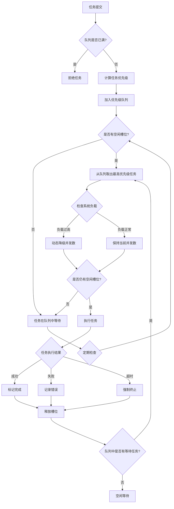
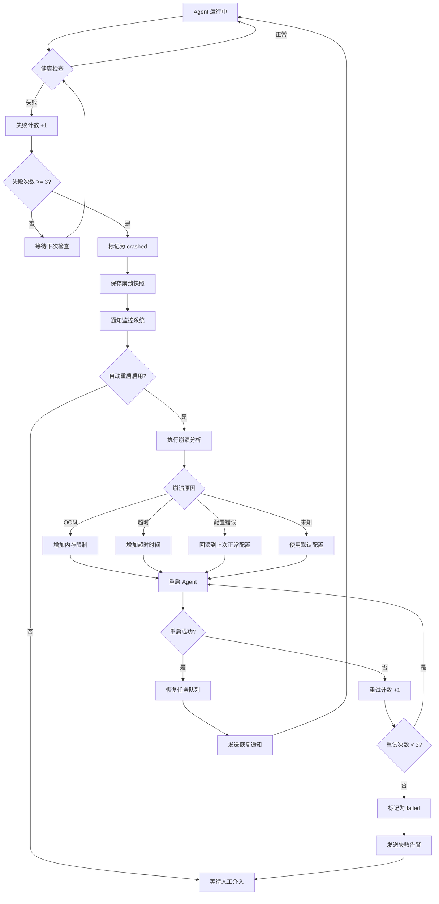

# Application Layer (应用层)

> **版本**: v4.0  
> **日期**: 2026-05-05  
> **关键词**: `AgentDaemon`, `ChannelRuntime`, `WorkflowRuntime`, `ExecutionRuntime`, `生命周期管理`, `消息队列`, `触发器`, `插件系统`, `并发控制`, `崩溃恢复`, `Memory管理`, `WAL队列`, `State Export/Import`, `Skills加载`

**本文档包含**:
- 4 个核心 Runtime 组件的运行时状态管理设计
- AgentDaemon 的完整生命周期管理流程（启动、运行、停止、崩溃恢复）
- 消息队列、触发器、插件的运行时机制
- 并发控制方案（max_concurrent_executions）
- Memory 管理方案（自动备份、压缩、保留策略）
- 崩溃恢复机制（状态检查点、自动重启）
- WAL 队列处理逻辑（DualWriteCoordinator）
- State Export/Import 实现（StateExporter/StateImporter）
- Skills 加载和验证流程

**适用场景**:
- 需要了解 Agent 的启动、运行、停止流程
- 查找消息路由和分发机制
- 理解触发器和插件的工作原理
- 设计并发控制或故障恢复方案
- 实现 Memory 自动备份和压缩
- 处理 WAL 队列或实现状态导出导入

**相关文档**:
- [Domain Layer](../../entities/README.md) - Runtime 组件对应的实体定义
- [Backend API](../../04-backend-api.md) - Runtime 组件的 API 接口
- [示例文件](../examples/) - Runtime 配置的完整示例

---

## 二、Runtime（应用层）

**设计说明**：

Runtime 层是系统的**运行时状态管理层**，负责管理各个实体在运行时的状态、生命周期和交互。根据系统架构，我们定义以下 Runtime 组件：

1. **AgentDaemon**（Agent 守护进程）- 核心 Runtime，管理 Agent 的生命周期、消息队列、触发器、插件
2. **ChannelRuntime**（频道运行时）- 管理频道的实时状态、成员在线状态、消息流
3. **WorkflowRuntime**（工作流运行时）- 管理工作流的执行状态、步骤调度、状态机
4. **ExecutionRuntime**（执行运行时）- 管理单次执行的实时状态、工具调用、日志流

**架构原则：框架无关性（Framework Independence）**

> **重要**：Runtime 层是**框架无关**的通用执行引擎。框架特定的实现细节（如 OpenClaw Gateway 连接、Claude Code 本地执行、Skills 路径等）由 **Backend Adapter 层**处理。
> 
> - **Runtime 层职责**：生命周期管理、状态同步、消息队列、触发器、插件系统
> - **Adapter 层职责**：框架协议转换、特定配置、连接管理
> - **配置原则**：Runtime 配置中的 `framework` 字段仅用于选择 Adapter 实现，不包含框架特定的配置细节
> 
> 详见：`docs/v4/architecture/03-backend/adapters/` - Backend Adapter 层设计文档

**为什么只保留这 4 个 Runtime？**

- **Entity 是数据定义**（静态配置），**Runtime 是运行时状态**（动态管理）
- 不是所有 Entity 都需要 Runtime：
  - `ProjectEntity`、`UserEntity`、`DeviceEntity` 是配置型实体，不需要独立的 Runtime
  - `MessageEntity`、`TaskEntity`、`OKREntity` 是数据型实体，通过 ChannelRuntime 管理即可
- Runtime 的职责是**生命周期管理**和**实时状态同步**，只有需要持续运行、状态变化频繁的实体才需要独立的 Runtime

**与 Entity 层的对应关系**：

| Runtime 文件 | Entity 层对应 | 说明 |
|---|---|---|
| `runtime/agent_daemon/{id}/daemon.yaml` | `agents/{id}/runtime.yaml` | daemon.yaml 是运行时动态状态，runtime.yaml 是静态配置 |
| `trigger_manager.triggers[].trigger_type` | `config/triggers.yaml[].trigger_type` | 字段名保持一致 |
| `plugin_manager.plugins[].features` | `config/plugins.yaml[].features` | 字段结构保持一致 |
| `runtime/agent_daemon/{id}/memory/` | `agents/{id}/memory/` | Memory 目录对应关系 |

**示例文件位置**：
所有配置文件的完整示例见 `docs/v4/architecture/runtime/examples/` 目录：
- `daemon.yaml` - AgentDaemon 运行时状态配置示例
- `channel-runtime.yaml` - ChannelRuntime 运行时状态配置示例
- `workflow-runtime.yaml` - WorkflowRuntime 运行时状态配置示例
- `execution-runtime.yaml` - ExecutionRuntime 运行时状态配置示例
- `startup.yaml` - AgentDaemon 启动配置示例
- `execution.jsonl` - 执行日志示例（JSONL 格式）

---

### 2.1 AgentDaemon（Agent 守护进程）

**运行时配置文件**: `runtime/agent_daemon/{agent_id}/daemon.yaml`

```yaml
# runtime/agent_daemon/agent-001/daemon.yaml
# AgentDaemon 运行时状态配置示例
# 注意：此文件记录运行时动态状态，与 Entity 层的 agents/{agent_id}/runtime.yaml（静态配置）不同

# 守护进程信息
daemon_id: "daemon-001"                  # 守护进程 ID
agent_id: "agent-001"                    # 关联的 Agent
pid: 12345                               # 进程 ID
status: "running"                        # 状态: starting | running | sleeping | stopping | stopped

# 服务对象
service_entities:
  - "AgentEntity"
  - "ConversationEntity"
  - "MessageEntity"
  - "ExecutionEntity"

# 核心组件（Threads）
components:
  # 心跳线程
  heartbeat_thread:
    enabled: true
    interval_seconds: 30                 # 心跳间隔
    timeout_seconds: 90                  # 超时时间
    last_heartbeat: "2026-05-02T10:29:30Z"
    status: "healthy"
    
  # 消息接收线程（Inbox）
  message_inbox_thread:
    enabled: true
    queue_size: 100                      # 队列大小
    poll_interval_ms: 100                # 轮询间隔
    pending_messages: 3                  # 待处理消息数
    status: "active"
    
  # 消息发送线程（Outbox）
  message_outbox_thread:
    enabled: true
    queue_size: 100
    batch_size: 10                       # 批量发送大小
    retry_attempts: 3
    pending_messages: 0
    status: "active"
    
  # 对话管理线程
  conversation_manager_thread:
    enabled: true
    max_conversations: 10                # 最大并发对话数
    active_conversations: 2              # 当前活跃对话数
    context_window_size: 200000          # 上下文窗口大小
    compression_enabled: true            # 是否启用压缩
    status: "active"
    
  # API 调用线程
  api_call_thread:
    enabled: true
    rate_limit_rpm: 60                   # 每分钟请求数限制
    rate_limit_tpm: 200000               # 每分钟 token 数限制
    current_rpm: 15                      # 当前每分钟请求数
    current_tpm: 50000                   # 当前每分钟 token 数
    queue_size: 50
    status: "active"

# Trigger 管理器（由 AgentDaemon 管理）
# 注意：trigger_type 和 schedule.cron 字段与 Entity 层 config/triggers.yaml 保持一致
trigger_manager:
  enabled: true
  active_triggers: 2
  triggers:
    - trigger_id: "trigger-001"
      name: "daily-architecture-review"          # kebab-case，与 Entity 层一致
      display_name: "每日架构审查"                # 人类可读名称
      trigger_type: "schedule"                   # 与 Entity 层 trigger_type 字段一致（非 type）
      schedule:
        cron: "0 9 * * *"                        # 与 Entity 层 schedule.cron 结构一致
        timezone: "Asia/Shanghai"
      next_run: "2026-05-03T09:00:00+08:00"
      status: "active"
      last_triggered: "2026-05-02T09:00:00+08:00"
      execution_count: 15
      
    - trigger_id: "trigger-002"
      name: "pr-auto-review"                     # kebab-case，与 Entity 层一致
      display_name: "PR 创建时自动审查"
      trigger_type: "event"                      # 与 Entity 层 trigger_type 字段一致（非 type）
      event:
        event_source: "github"                   # 与 Entity 层 event.event_source 结构一致
        event_type: "pull_request.opened"
      status: "active"
      last_triggered: "2026-05-01T15:30:00+08:00"
      execution_count: 8

# Plugin 管理器（由 AgentDaemon 管理）
# 注意：name 使用 kebab-case，display_name 使用人类可读名称，features 与 Entity 层一致
plugin_manager:
  enabled: true
  active_plugins: 1
  plugins:
    - plugin_id: "plugin-001"
      name: "github-integration"                 # kebab-case，与 Entity 层 config/plugins.yaml 一致
      display_name: "GitHub Integration"         # 人类可读名称
      version: "1.0.0"
      status: "active"
      loaded_at: "2026-05-02T10:00:00Z"
      features:                                  # 与 Entity 层 features 结构一致（非 capabilities）
        - feature_id: "pr-review"
          name: "PR 审查"
          enabled: true
          permissions:
            - "read:pull_request"
            - "write:pull_request_comment"
        - feature_id: "issue-management"
          name: "Issue 管理"
          enabled: true
          permissions:
            - "read:issue"
            - "write:issue"
      config:
        token: "${GITHUB_TOKEN}"
        repo: "owner/repo"
      health_check:
        last_check: "2026-05-02T10:29:00Z"
        status: "healthy"
        
    - plugin_id: "plugin-002"
      name: "feishu-notification"                # kebab-case，与 Entity 层一致
      display_name: "Feishu Notification"
      version: "1.0.0"
      status: "inactive"
      loaded_at: null
      features:
        - feature_id: "message-push"
          name: "消息推送"
          enabled: true
          permissions:
            - "send:message"
      config:
        webhook_url: "${FEISHU_WEBHOOK}"
      health_check:
        last_check: null
        status: "unknown"

# 资源使用
resource_usage:
  cpu_percent: 15.5                      # CPU 使用率
  memory_mb: 512                         # 内存使用（MB）
  disk_io_mb: 25                         # 磁盘 IO（MB）
  network_io_mb: 10                      # 网络 IO（MB）

# 统计信息
statistics:
  total_messages_received: 1523
  total_messages_sent: 1489
  total_executions: 156
  total_errors: 12
  uptime_seconds: 86400                  # 运行时长（秒）
  started_at: "2026-05-01T10:00:00Z"

# 映射到 Backend
backend_services:
  - "AgentRuntimeService"
  - "AgentChatService"
  - "ExecutionService"
```

---

#### 2.1.1 并发控制配置（P0）

**问题**：多个任务同时分配给同一个 Agent 时，如何控制并发执行？

**解决方案**：基于优先级的任务队列 + 并发限制

```yaml
# agents/{agent_id}/runtime.yaml 中的并发控制配置（与 Entity 层 runtime.yaml 对应）
runtime:
  # 并发控制
  concurrency:
    max_concurrent_executions: 5           # 最大并发执行数（默认 5）
    queue_strategy: "priority"             # 排队策略: priority | fifo
    queue_max_size: 100                    # 队列最大长度
    
    # 优先级定义
    priority_levels:
      P0: 1000                             # 紧急任务
      P1: 100                              # 高优先级
      P2: 10                               # 中优先级
      P3: 1                                # 低优先级
    
    # 动态调整
    auto_scaling:
      enabled: true
      cpu_threshold: 80                    # CPU 超过 80% 时降级
      memory_threshold: 80                 # 内存超过 80% 时降级
      scale_down_factor: 0.5               # 降级时减半
```

**实现代码**：

```python
# runtime/agent_daemon/concurrency_manager.py

from queue import PriorityQueue
from dataclasses import dataclass
from typing import Optional
import psutil

@dataclass
class Task:
    task_id: str
    priority: str  # P0, P1, P2, P3
    created_at: datetime
    
    def __lt__(self, other):
        # 优先级队列排序：P0 > P1 > P2 > P3 > FIFO
        priority_map = {"P0": 1000, "P1": 100, "P2": 10, "P3": 1}
        self_priority = priority_map.get(self.priority, 0)
        other_priority = priority_map.get(other.priority, 0)
        
        if self_priority != other_priority:
            return self_priority > other_priority
        else:
            # 同优先级按 FIFO
            return self.created_at < other.created_at

class ConcurrencyManager:
    """并发控制管理器"""
    
    def __init__(self, config: dict):
        self.max_concurrent = config.get("max_concurrent_executions", 5)
        self.queue_strategy = config.get("queue_strategy", "priority")
        self.queue_max_size = config.get("queue_max_size", 100)
        self.auto_scaling = config.get("auto_scaling", {})
        
        self.task_queue = PriorityQueue(maxsize=self.queue_max_size)
        self.running_tasks = {}  # {task_id: execution}
        self.lock = asyncio.Lock()
    
    async def submit_task(self, task: Task) -> bool:
        """提交任务到队列"""
        async with self.lock:
            # 检查队列是否已满
            if self.task_queue.full():
                logger.warning(f"Task queue full, rejecting task {task.task_id}")
                return False
            
            # 加入队列
            self.task_queue.put(task)
            logger.info(f"Task {task.task_id} queued (priority: {task.priority})")
            
            # 尝试调度执行
            await self._schedule_next_task()
            return True
    
    async def _schedule_next_task(self):
        """调度下一个任务"""
        # 检查是否有空闲槽位
        if len(self.running_tasks) >= self._get_current_max_concurrent():
            return
        
        # 从队列取出任务
        if not self.task_queue.empty():
            task = self.task_queue.get()
            
            # 执行任务
            execution = await self._execute_task(task)
            self.running_tasks[task.task_id] = execution
    
    async def _execute_task(self, task: Task):
        """执行任务"""
        try:
            logger.info(f"Executing task {task.task_id}")
            execution = await agent_executor.execute(task)
            return execution
        finally:
            # 任务完成后，从运行列表移除
            async with self.lock:
                self.running_tasks.pop(task.task_id, None)
                # 调度下一个任务
                await self._schedule_next_task()
    
    def _get_current_max_concurrent(self) -> int:
        """获取当前最大并发数（支持动态调整）"""
        if not self.auto_scaling.get("enabled", False):
            return self.max_concurrent
        
        # 检查系统负载
        cpu_percent = psutil.cpu_percent(interval=1)
        memory_percent = psutil.virtual_memory().percent
        
        cpu_threshold = self.auto_scaling.get("cpu_threshold", 80)
        memory_threshold = self.auto_scaling.get("memory_threshold", 80)
        scale_down_factor = self.auto_scaling.get("scale_down_factor", 0.5)
        
        # 如果负载过高，降级
        if cpu_percent > cpu_threshold or memory_percent > memory_threshold:
            scaled_max = int(self.max_concurrent * scale_down_factor)
            logger.warning(f"High load detected (CPU: {cpu_percent}%, Memory: {memory_percent}%), scaling down to {scaled_max}")
            return max(1, scaled_max)  # 至少保留 1 个并发
        
        return self.max_concurrent
    
    def get_queue_status(self) -> dict:
        """获取队列状态"""
        return {
            "queue_size": self.task_queue.qsize(),
            "running_tasks": len(self.running_tasks),
            "max_concurrent": self._get_current_max_concurrent(),
            "queue_max_size": self.queue_max_size
        }
```

---

#### 2.1.2 Memory 管理策略（P0）


**问题**：Agent 长时间运行后，MEMORY.md 和上下文会无限增长

**解决方案**：自动压缩 + 定期备份 + 保留策略

```yaml
# agents/{agent_id}/runtime.yaml 中的 Memory 管理配置（与 Entity 层 runtime.yaml 对应）
runtime:
  memory:
    # 压缩策略
    compression:
      enabled: true
      threshold_tokens: 150000             # 压缩阈值（75% context window）
      algorithm: "structured_9_section"    # 压缩算法
      preserve_recent_messages: 50         # 保留最近 N 条消息
    
    # 备份策略
    backup:
      enabled: true
      frequency: "on_compression"          # 备份频率: on_compression | hourly | daily
      retention_days: 7                    # 保留天数
      backup_path: "workspace/backups/"
    
    # 清理策略
    cleanup:
      enabled: true
      max_memory_size_mb: 100              # MEMORY.md 最大大小（MB）
      archive_old_notes: true              # 归档旧笔记
      archive_threshold_days: 30           # 归档阈值（天）
```

**实现代码**：

```python
# runtime/agent_daemon/memory_manager.py

class MemoryManager:
    """Memory 管理器"""
    
    def __init__(self, config: dict, workspace_path: str):
        self.config = config
        self.workspace_path = workspace_path
        self.memory_path = os.path.join(workspace_path, "MEMORY.md")
        self.backup_path = os.path.join(workspace_path, "backups")
        
        self.compression_threshold = config.get("compression", {}).get("threshold_tokens", 150000)
        self.backup_enabled = config.get("backup", {}).get("enabled", True)
        self.backup_frequency = config.get("backup", {}).get("frequency", "on_compression")
        self.retention_days = config.get("backup", {}).get("retention_days", 7)
    
    async def check_and_compress(self, current_tokens: int):
        """检查并压缩 Memory"""
        if current_tokens < self.compression_threshold:
            return
        
        logger.info(f"Memory compression triggered (tokens: {current_tokens})")
        
        # 1. 备份当前 MEMORY.md
        if self.backup_enabled:
            await self._backup_memory()
        
        # 2. 执行压缩
        await self._compress_memory()
        
        # 3. 清理旧备份
        await self._cleanup_old_backups()
    
    async def _backup_memory(self):
        """备份 MEMORY.md"""
        os.makedirs(self.backup_path, exist_ok=True)
        
        timestamp = datetime.utcnow().strftime("%Y%m%d_%H%M%S")
        backup_file = os.path.join(self.backup_path, f"MEMORY_{timestamp}.md")
        
        shutil.copy2(self.memory_path, backup_file)
        logger.info(f"Memory backed up to {backup_file}")
    
    async def _compress_memory(self):
        """压缩 MEMORY.md（使用结构化 9 节算法）"""
        # 读取当前 MEMORY.md
        with open(self.memory_path, 'r') as f:
            content = f.read()
        
        # 调用压缩算法（结构化 9 节）
        compressed = await self._structured_9_section_compress(content)
        
        # 写回 MEMORY.md
        with open(self.memory_path, 'w') as f:
            f.write(compressed)
        
        logger.info(f"Memory compressed (original: {len(content)} chars, compressed: {len(compressed)} chars)")
    
    async def _structured_9_section_compress(self, content: str) -> str:
        """结构化 9 节压缩算法"""
        # 这里使用 Claude 的压缩能力
        prompt = f"""
        请将以下 MEMORY.md 内容压缩为结构化的 9 个关键部分：
        1. 角色定义
        2. 关键知识索引
        3. 活跃上下文
        4. 用户偏好
        5. 项目上下文
        6. 工作历史
        7. 频道上下文
        8. 其他 Agent
        9. 待办事项
        
        保留所有关键信息，删除冗余内容。
        
        原始内容：
        {content}
        """
        
        compressed = await claude_api.compress(prompt)
        return compressed
    
    async def _cleanup_old_backups(self):
        """清理旧备份"""
        if not os.path.exists(self.backup_path):
            return
        
        cutoff_date = datetime.utcnow() - timedelta(days=self.retention_days)
        
        for filename in os.listdir(self.backup_path):
            filepath = os.path.join(self.backup_path, filename)
            file_mtime = datetime.fromtimestamp(os.path.getmtime(filepath))
            
            if file_mtime < cutoff_date:
                os.remove(filepath)
                logger.info(f"Deleted old backup: {filename}")
    
    async def schedule_periodic_backup(self):
        """定期备份（每 24 小时）"""
        if self.backup_frequency != "daily":
            return
        
        while True:
            await asyncio.sleep(86400)  # 24 小时
            await self._backup_memory()
```

---

#### 2.1.3 执行超时处理（P0）

**问题**：Agent 执行任务时可能卡死或无限循环

**解决方案**：分级超时 + 优雅退出 + 强制终止

```yaml
# agents/{agent_id}/runtime.yaml 中的超时配置（与 Entity 层 runtime.yaml 对应）
runtime:
  timeout:
    # 分级超时设置
    short_task_timeout_seconds: 120        # 短任务：2 分钟
    medium_task_timeout_seconds: 600       # 中任务：10 分钟
    long_task_timeout_seconds: 1800        # 长任务：30 分钟
    
    # 默认超时（如果任务未指定类型）
    default_timeout_seconds: 600
    
    # 清理机制
    cleanup:
      grace_period_seconds: 5              # 优雅退出等待时间
      force_kill_enabled: true             # 是否启用强制终止
      
    # 告警
    alert:
      enabled: true
      send_system_message: true            # 发送 system message 到相关 channel
      log_to_file: true                    # 记录到日志文件
```

**实现代码**：

```python
# runtime/agent_daemon/timeout_manager.py

class TimeoutManager:
    """超时管理器"""
    
    def __init__(self, config: dict):
        self.config = config
        self.timeout_map = {
            "short": config.get("short_task_timeout_seconds", 120),
            "medium": config.get("medium_task_timeout_seconds", 600),
            "long": config.get("long_task_timeout_seconds", 1800)
        }
        self.default_timeout = config.get("default_timeout_seconds", 600)
        self.grace_period = config.get("cleanup", {}).get("grace_period_seconds", 5)
        self.force_kill_enabled = config.get("cleanup", {}).get("force_kill_enabled", True)
    
    async def execute_with_timeout(
        self,
        task: Task,
        executor_func,
        task_type: str = "medium"
    ):
        """带超时的任务执行"""
        timeout = self.timeout_map.get(task_type, self.default_timeout)
        
        try:
            # 使用 asyncio.wait_for 设置超时
            result = await asyncio.wait_for(
                executor_func(task),
                timeout=timeout
            )
            return result
            
        except asyncio.TimeoutError:
            logger.error(f"Task {task.task_id} timed out after {timeout}s")
            
            # 执行清理
            await self._cleanup_timeout_task(task)
            
            # 发送告警
            await self._send_timeout_alert(task, timeout)
            
            raise TaskTimeoutError(f"Task {task.task_id} timed out")
    
    async def _cleanup_timeout_task(self, task: Task):
        """清理超时任务"""
        logger.info(f"Cleaning up timeout task {task.task_id}")
        
        # 1. 优雅退出：发送 SIGTERM
        try:
            await self._send_graceful_shutdown(task)
            
            # 等待 grace period
            await asyncio.sleep(self.grace_period)
            
            # 检查是否已退出
            if await self._is_task_running(task):
                # 2. 强制终止：发送 SIGKILL
                if self.force_kill_enabled:
                    await self._force_kill_task(task)
                    logger.warning(f"Task {task.task_id} force killed")
                else:
                    logger.error(f"Task {task.task_id} still running after grace period")
            else:
                logger.info(f"Task {task.task_id} gracefully exited")
                
        except Exception as e:
            logger.error(f"Failed to cleanup task {task.task_id}: {e}")
    
    async def _send_graceful_shutdown(self, task: Task):
        """发送优雅退出信号"""
        # 向 Agent 进程发送 SIGTERM
        if task.process_id:
            os.kill(task.process_id, signal.SIGTERM)
    
    async def _force_kill_task(self, task: Task):
        """强制终止任务"""
        # 向 Agent 进程发送 SIGKILL
        if task.process_id:
            os.kill(task.process_id, signal.SIGKILL)
    
    async def _is_task_running(self, task: Task) -> bool:
        """检查任务是否还在运行"""
        if not task.process_id:
            return False
        
        try:
            # 检查进程是否存在
            os.kill(task.process_id, 0)
            return True
        except OSError:
            return False
    
    async def _send_timeout_alert(self, task: Task, timeout: int):
        """发送超时告警"""
        if not self.config.get("alert", {}).get("enabled", True):
            return
        
        # 发送 system message 到相关 channel
        if self.config.get("alert", {}).get("send_system_message", True):
            await message_service.send_system_message(
                channel_id=task.channel_id,
                content=f"⚠️ Task #{task.task_number} timed out after {timeout}s and was terminated."
            )
        
        # 记录到日志文件
        if self.config.get("alert", {}).get("log_to_file", True):
            logger.error(f"TIMEOUT: Task {task.task_id} ({task.title}) exceeded {timeout}s limit")
```

---

#### 2.1.4 配置验证机制（P0）

**问题**：Agent 启动时配置文件可能有错误或冲突
[Review] 默认值填充需要尤其注意大部分配置是不需要填充的，需要使用最小化填充，保证 API 的正常请求就可以。
**解决方案**：JSON Schema 验证 + 冲突检测 + 默认值填充

```python
# runtime/agent_daemon/config_validator.py

from jsonschema import validate, ValidationError
from dataclasses import dataclass, field

# JSON Schema 定义
AGENT_CONFIG_SCHEMA = {
    "type": "object",
    "properties": {
        "agent_id": {"type": "string", "pattern": "^agent-[0-9]+$"},
        "name": {"type": "string", "minLength": 1, "maxLength": 255},
        "framework": {"type": "string", "enum": ["claude_code", "openclaw", "custom"]},
        "model": {"type": "string"},
        "runtime": {
            "type": "object",
            "properties": {
                "concurrency": {
                    "type": "object",
                    "properties": {
                        "max_concurrent_executions": {"type": "integer", "minimum": 1, "maximum": 100},
                        "queue_max_size": {"type": "integer", "minimum": 1}
                    }
                },
                "memory": {
                    "type": "object",
                    "properties": {
                        "compression": {
                            "type": "object",
                            "properties": {
                                "threshold_tokens": {"type": "integer", "minimum": 1000}
                            }
                        }
                    }
                },
                "timeout": {
                    "type": "object",
                    "properties": {
                        "default_timeout_seconds": {"type": "integer", "minimum": 1}
                    }
                }
            }
        }
    },
    "required": ["agent_id", "name", "framework"]
}

@dataclass
class AgentConfig:
    """Agent 配置（带默认值）"""
    agent_id: str
    name: str
    framework: str
    model: str = "claude-opus-4"
    
    # Runtime 配置（使用 dataclass 的 field(default_factory=...)）
    max_concurrent_executions: int = 5
    queue_max_size: int = 100
    compression_threshold_tokens: int = 150000
    default_timeout_seconds: int = 600
    
    @classmethod
    def from_yaml(cls, yaml_path: str) -> "AgentConfig":
        """从 YAML 文件加载配置"""
        with open(yaml_path, 'r') as f:
            data = yaml.safe_load(f)
        
        # 1. JSON Schema 验证
        try:
            validate(instance=data, schema=AGENT_CONFIG_SCHEMA)
        except ValidationError as e:
            raise ConfigValidationError(f"Invalid agent config: {e.message}")
        
        # 2. 冲突检测
        cls._check_conflicts(data)
        
        # 3. 提取配置（自动填充默认值）
        return cls(
            agent_id=data["agent_id"],
            name=data["name"],
            framework=data["framework"],
            model=data.get("model", "claude-opus-4"),
            max_concurrent_executions=data.get("runtime", {}).get("concurrency", {}).get("max_concurrent_executions", 5),
            queue_max_size=data.get("runtime", {}).get("concurrency", {}).get("queue_max_size", 100),
            compression_threshold_tokens=data.get("runtime", {}).get("memory", {}).get("compression", {}).get("threshold_tokens", 150000),
            default_timeout_seconds=data.get("runtime", {}).get("timeout", {}).get("default_timeout_seconds", 600)
        )
    
    @staticmethod
    def _check_conflicts(data: dict):
        """检测配置冲突"""
        # 冲突 1：execution_timeout < health_check_interval
        timeout = data.get("runtime", {}).get("timeout", {}).get("default_timeout_seconds", 600)
        health_check_interval = data.get("runtime", {}).get("health_check_interval_seconds", 60)
        
        if timeout < health_check_interval:
            raise ConfigConflictError(
                f"execution_timeout ({timeout}s) must be >= health_check_interval ({health_check_interval}s)"
            )
        
        # 冲突 2：max_concurrent_executions > queue_max_size
        max_concurrent = data.get("runtime", {}).get("concurrency", {}).get("max_concurrent_executions", 5)
        queue_max_size = data.get("runtime", {}).get("concurrency", {}).get("queue_max_size", 100)
        
        if max_concurrent > queue_max_size:
            logger.warning(
                f"max_concurrent_executions ({max_concurrent}) > queue_max_size ({queue_max_size}), "
                "this may cause task rejection"
            )

class ConfigValidationError(Exception):
    pass

class ConfigConflictError(Exception):
    pass
```

---

#### 2.1.5 Agent 通信协议（P0）

**消息格式**：与 slock CLI 保持一致，使用 JSON

```json
{
  "type": "task_assignment",
  "from": "user-001",
  "to": "agent-001",
  "task_id": "task-123",
  "priority": "P1",
  "content": "Fix the login bug",
  "timestamp": "2026-05-02T10:30:00Z"
}
```

**错误码体系**：

| 错误码前缀 | 类型 | 示例 |
|-----------|------|------|
| `AGENT_4xx` | Agent 客户端错误 | `AGENT_400_INVALID_INPUT` |
| `RUNTIME_5xx` | Runtime 运行时错误 | `RUNTIME_500_EXECUTION_FAILED` |

**心跳机制**：

```yaml
# agents/{agent_id}/runtime.yaml 中的心跳配置（与 Entity 层 runtime.yaml 对应）
runtime:
  health_check:
    enabled: true
    interval_seconds: 30                   # 每 30 秒发送一次心跳
    timeout_seconds: 90                    # 3 次失败（90s）标记为 crashed
    endpoint: "/health"
```

**实现代码**：

```python
# runtime/agent_daemon/health_check.py

class HealthCheckManager:
    """健康检查管理器"""
    
    def __init__(self, config: dict):
        self.enabled = config.get("enabled", True)
        self.interval = config.get("interval_seconds", 30)
        self.timeout = config.get("timeout_seconds", 90)
        self.failed_checks = 0
        self.max_failed_checks = self.timeout // self.interval  # 3 次
    
    async def start_health_check_loop(self):
        """启动健康检查循环"""
        if not self.enabled:
            return
        
        while True:
            try:
                await asyncio.sleep(self.interval)
                
                # 发送心跳
                success = await self._send_heartbeat()
                
                if success:
                    self.failed_checks = 0
                else:
                    self.failed_checks += 1
                    logger.warning(f"Health check failed ({self.failed_checks}/{self.max_failed_checks})")
                    
                    # 达到最大失败次数，标记为 crashed
                    if self.failed_checks >= self.max_failed_checks:
                        logger.error("Agent marked as crashed due to failed health checks")
                        await self._mark_as_crashed()
                        break
                        
            except Exception as e:
                logger.error(f"Health check error: {e}")
    
    async def _send_heartbeat(self) -> bool:
        """发送心跳"""
        try:
            response = await http_client.post("/health", json={
                "agent_id": agent_id,
                "status": "healthy",
                "timestamp": datetime.utcnow().isoformat()
            })
            return response.status_code == 200
        except Exception as e:
            logger.error(f"Failed to send heartbeat: {e}")
            return False
    
    async def _mark_as_crashed(self):
        """标记为 crashed"""
        await agent_service.update_status(agent_id, "crashed")
```

---

#### 2.1.6 并发控制流程图（P1-7）

**完整并发控制流程**：从任务提交到执行完成的全流程设计



**优先级计算规则**：

```python
def calculate_priority(task: Task) -> int:
    """
    计算任务优先级分数（分数越高，优先级越高）
    
    优先级 = 基础分数 + 等待时间加成 + 用户优先级加成
    """
    # 基础分数
    priority_map = {
        "P0": 1000,  # 紧急任务
        "P1": 100,   # 高优先级
        "P2": 10,    # 中优先级
        "P3": 1      # 低优先级
    }
    base_score = priority_map.get(task.priority, 0)
    
    # 等待时间加成（防止饥饿）
    wait_time_seconds = (datetime.utcnow() - task.created_at).total_seconds()
    wait_bonus = min(wait_time_seconds / 60, 50)  # 最多加 50 分
    
    # 用户优先级加成
    user_bonus = 0
    if task.user_id in high_priority_users:
        user_bonus = 20
    
    total_score = base_score + wait_bonus + user_bonus
    return int(total_score)
```

**动态降级策略**：

```python
def get_scaled_max_concurrent(self) -> int:
    """
    根据系统负载动态调整最大并发数
    
    降级规则：
    - CPU > 80% 或 Memory > 80%：降级到 50%
    - CPU > 90% 或 Memory > 90%：降级到 25%
    - 否则：保持 100%
    """
    cpu_percent = psutil.cpu_percent(interval=1)
    memory_percent = psutil.virtual_memory().percent
    
    if cpu_percent > 90 or memory_percent > 90:
        scale_factor = 0.25
        logger.warning(f"Critical load (CPU: {cpu_percent}%, Mem: {memory_percent}%), scaling to 25%")
    elif cpu_percent > 80 or memory_percent > 80:
        scale_factor = 0.5
        logger.warning(f"High load (CPU: {cpu_percent}%, Mem: {memory_percent}%), scaling to 50%")
    else:
        scale_factor = 1.0
    
    scaled_max = int(self.max_concurrent * scale_factor)
    return max(1, scaled_max)  # 至少保留 1 个并发
```

**队列状态监控**：

```python
def get_queue_metrics(self) -> dict:
    """获取队列状态指标"""
    return {
        "queue_size": self.task_queue.qsize(),
        "queue_max_size": self.queue_max_size,
        "queue_utilization": self.task_queue.qsize() / self.queue_max_size,
        "running_tasks": len(self.running_tasks),
        "max_concurrent": self.max_concurrent,
        "current_max_concurrent": self._get_current_max_concurrent(),
        "concurrency_utilization": len(self.running_tasks) / self._get_current_max_concurrent(),
        "oldest_waiting_task_age_seconds": self._get_oldest_waiting_task_age(),
        "average_wait_time_seconds": self._get_average_wait_time(),
        "tasks_rejected_last_hour": self.metrics.get("rejected_count", 0)
    }
```

---

#### 2.1.7 Memory 管理完整方案（P1-8）
[Review]这里的定义好像和 Entity 定义有差别，给出原因和修改建议。

**Memory 管理架构**：分层缓存 + 自动压缩 + 智能归档

```
Memory 管理层次：
┌─────────────────────────────────────────┐
│  L1: 热数据（MEMORY.md）                │
│  - 最近 50 条消息                        │
│  - 活跃上下文                            │
│  - 当前任务状态                          │
│  - 大小限制：100 MB                      │
└─────────────────────────────────────────┘
           ↓ 压缩阈值：150K tokens
┌─────────────────────────────────────────┐
│  L2: 温数据（notes/）                    │
│  - 用户偏好                              │
│  - 项目上下文                            │
│  - 频道上下文                            │
│  - 工作历史                              │
│  - 大小限制：500 MB                      │
└─────────────────────────────────────────┘
           ↓ 归档阈值：30 天未访问
┌─────────────────────────────────────────┐
│  L3: 冷数据（backups/）                  │
│  - 历史备份                              │
│  - 归档笔记                              │
│  - 保留期限：7 天                        │
└─────────────────────────────────────────┘
```

**压缩算法实现**：

```python
class StructuredMemoryCompressor:
    """结构化 Memory 压缩器"""
    
    async def compress(self, memory_content: str) -> str:
        """
        使用结构化 9 节算法压缩 MEMORY.md
        
        压缩策略：
        1. 保留结构化索引（9 个关键部分）
        2. 压缩冗余内容（相似描述合并）
        3. 保留关键信息（决策、结论、待办）
        4. 删除过时信息（已完成任务、旧对话）
        """
        sections = self._parse_sections(memory_content)
        
        compressed_sections = {
            "role": self._compress_role(sections.get("role", "")),
            "knowledge_index": self._compress_knowledge_index(sections.get("knowledge_index", "")),
            "active_context": self._compress_active_context(sections.get("active_context", "")),
            "user_preferences": self._compress_user_preferences(sections.get("user_preferences", "")),
            "project_context": self._compress_project_context(sections.get("project_context", "")),
            "work_history": self._compress_work_history(sections.get("work_history", "")),
            "channel_context": self._compress_channel_context(sections.get("channel_context", "")),
            "other_agents": self._compress_other_agents(sections.get("other_agents", "")),
            "todos": self._compress_todos(sections.get("todos", ""))
        }
        
        return self._render_compressed_memory(compressed_sections)
    
    def _compress_work_history(self, content: str) -> str:
        """
        压缩工作历史
        
        策略：
        - 保留最近 10 个任务的完整记录
        - 其他任务只保留标题和结论
        - 删除超过 30 天的任务记录
        """
        tasks = self._parse_tasks(content)
        
        # 按时间排序
        tasks.sort(key=lambda t: t.completed_at, reverse=True)
        
        # 保留最近 10 个任务的完整记录
        recent_tasks = tasks[:10]
        
        # 其他任务只保留摘要
        old_tasks = tasks[10:]
        old_tasks_summary = [
            f"- {t.title} (完成于 {t.completed_at.strftime('%Y-%m-%d')}): {t.conclusion}"
            for t in old_tasks
            if (datetime.utcnow() - t.completed_at).days <= 30
        ]
        
        compressed = "## 最近任务\n\n"
        for task in recent_tasks:
            compressed += f"### {task.title}\n"
            compressed += f"- 完成时间: {task.completed_at}\n"
            compressed += f"- 结论: {task.conclusion}\n"
            compressed += f"- 关键决策: {task.key_decisions}\n\n"
        
        if old_tasks_summary:
            compressed += "## 历史任务摘要\n\n"
            compressed += "\n".join(old_tasks_summary)
        
        return compressed
```

**备份和恢复机制**：

```python
class MemoryBackupManager:
    """Memory 备份管理器"""
    
    def __init__(self, workspace_path: str):
        self.workspace_path = workspace_path
        self.backup_path = os.path.join(workspace_path, "backups")
        self.memory_path = os.path.join(workspace_path, "MEMORY.md")
    
    async def create_backup(self, trigger: str = "manual") -> str:
        """
        创建备份
        
        触发方式：
        - manual: 手动触发
        - compression: 压缩前自动备份
        - scheduled: 定时备份（每 24 小时）
        - crash: 崩溃前紧急备份
        """
        os.makedirs(self.backup_path, exist_ok=True)
        
        timestamp = datetime.utcnow().strftime("%Y%m%d_%H%M%S_%f")
        backup_file = os.path.join(
            self.backup_path,
            f"MEMORY_{timestamp}_{trigger}.md"
        )
        
        # 复制 MEMORY.md
        shutil.copy2(self.memory_path, backup_file)
        
        # 同时备份 notes/ 目录（增量备份）
        notes_backup = os.path.join(
            self.backup_path,
            f"notes_{timestamp}_{trigger}.tar.gz"
        )
        await self._create_notes_backup(notes_backup)
        
        logger.info(f"Backup created: {backup_file}")
        return backup_file
    
    async def restore_backup(self, backup_file: str):
        """
        恢复备份
        
        恢复流程：
        1. 验证备份文件完整性
        2. 创建当前状态的紧急备份
        3. 恢复 MEMORY.md
        4. 恢复 notes/ 目录
        5. 验证恢复结果
        """
        # 1. 验证备份文件
        if not os.path.exists(backup_file):
            raise FileNotFoundError(f"Backup file not found: {backup_file}")
        
        # 2. 创建紧急备份
        emergency_backup = await self.create_backup(trigger="pre_restore")
        
        try:
            # 3. 恢复 MEMORY.md
            shutil.copy2(backup_file, self.memory_path)
            
            # 4. 恢复 notes/
            notes_backup = backup_file.replace("MEMORY_", "notes_").replace(".md", ".tar.gz")
            if os.path.exists(notes_backup):
                await self._restore_notes_backup(notes_backup)
            
            # 5. 验证恢复结果
            await self._verify_memory_integrity()
            
            logger.info(f"Backup restored successfully: {backup_file}")
            
        except Exception as e:
            # 恢复失败，回滚到紧急备份
            logger.error(f"Restore failed, rolling back: {e}")
            shutil.copy2(emergency_backup, self.memory_path)
            raise
    
    async def cleanup_old_backups(self, retention_days: int = 7):
        """清理旧备份"""
        if not os.path.exists(self.backup_path):
            return
        
        cutoff_date = datetime.utcnow() - timedelta(days=retention_days)
        
        for filename in os.listdir(self.backup_path):
            filepath = os.path.join(self.backup_path, filename)
            file_mtime = datetime.fromtimestamp(os.path.getmtime(filepath))
            
            if file_mtime < cutoff_date:
                os.remove(filepath)
                logger.info(f"Deleted old backup: {filename}")
```

**智能归档策略**：

```python
class MemoryArchiver:
    """Memory 归档管理器"""
    
    async def archive_old_notes(self, threshold_days: int = 30):
        """
        归档旧笔记
        
        归档规则：
        - 超过 30 天未访问的笔记移到 archive/
        - 保留笔记索引，但内容压缩
        - 归档文件使用 gzip 压缩
        """
        notes_path = os.path.join(self.workspace_path, "notes")
        archive_path = os.path.join(self.workspace_path, "archive")
        
        os.makedirs(archive_path, exist_ok=True)
        
        cutoff_date = datetime.utcnow() - timedelta(days=threshold_days)
        
        for filename in os.listdir(notes_path):
            filepath = os.path.join(notes_path, filename)
            
            # 跳过目录和特殊文件
            if not os.path.isfile(filepath) or filename.startswith("."):
                continue
            
            # 检查最后访问时间
            last_access = datetime.fromtimestamp(os.path.getatime(filepath))
            
            if last_access < cutoff_date:
                # 归档文件
                archive_file = os.path.join(
                    archive_path,
                    f"{filename}.{datetime.utcnow().strftime('%Y%m%d')}.gz"
                )
                
                with open(filepath, 'rb') as f_in:
                    with gzip.open(archive_file, 'wb') as f_out:
                        shutil.copyfileobj(f_in, f_out)
                
                # 删除原文件
                os.remove(filepath)
                
                logger.info(f"Archived old note: {filename}")
```

---

#### 2.1.8 崩溃恢复机制（P1-9）

**崩溃检测和自动恢复流程**：



**崩溃快照保存**：

```python
class CrashSnapshotManager:
    """崩溃快照管理器"""
    
    async def save_crash_snapshot(self, agent_id: str, error: Exception):
        """
        保存崩溃快照
        
        快照内容：
        1. Agent 配置
        2. 运行时状态
        3. 任务队列
        4. 最近日志
        5. 系统资源使用
        6. 错误堆栈
        """
        snapshot_dir = os.path.join(
            self.workspace_path,
            "crash_snapshots",
            datetime.utcnow().strftime("%Y%m%d_%H%M%S")
        )
        os.makedirs(snapshot_dir, exist_ok=True)
        
        snapshot = {
            "timestamp": datetime.utcnow().isoformat(),
            "agent_id": agent_id,
            "error": {
                "type": type(error).__name__,
                "message": str(error),
                "traceback": traceback.format_exc()
            },
            "config": await self._get_agent_config(agent_id),
            "runtime_state": await self._get_runtime_state(agent_id),
            "task_queue": await self._get_task_queue(agent_id),
            "recent_logs": await self._get_recent_logs(agent_id, lines=100),
            "system_resources": {
                "cpu_percent": psutil.cpu_percent(),
                "memory_percent": psutil.virtual_memory().percent,
                "disk_usage": psutil.disk_usage('/').percent
            }
        }
        
        # 保存快照
        snapshot_file = os.path.join(snapshot_dir, "snapshot.json")
        with open(snapshot_file, 'w') as f:
            json.dump(snapshot, f, indent=2)
        
        # 保存 MEMORY.md 副本
        memory_file = os.path.join(self.workspace_path, "MEMORY.md")
        if os.path.exists(memory_file):
            shutil.copy2(
                memory_file,
                os.path.join(snapshot_dir, "MEMORY.md")
            )
        
        logger.info(f"Crash snapshot saved: {snapshot_dir}")
        return snapshot_file
```

**自动重启策略**：

```python
class AutoRestartManager:
    """自动重启管理器"""
    
    def __init__(self, config: dict):
        self.enabled = config.get("auto_restart", {}).get("enabled", True)
        self.max_retries = config.get("auto_restart", {}).get("max_retries", 3)
        self.retry_delay_seconds = config.get("auto_restart", {}).get("retry_delay_seconds", 10)
        self.backoff_multiplier = config.get("auto_restart", {}).get("backoff_multiplier", 2)
    
    async def restart_agent(self, agent_id: str, crash_reason: str) -> bool:
        """
        重启 Agent
        
        重启策略：
        1. 分析崩溃原因
        2. 调整配置（如果需要）
        3. 清理残留进程
        4. 重启 Agent
        5. 恢复任务队列
        """
        if not self.enabled:
            logger.info(f"Auto-restart disabled for agent {agent_id}")
            return False
        
        retry_count = 0
        delay = self.retry_delay_seconds
        
        while retry_count < self.max_retries:
            try:
                logger.info(f"Attempting to restart agent {agent_id} (attempt {retry_count + 1}/{self.max_retries})")
                
                # 1. 分析崩溃原因并调整配置
                adjusted_config = await self._analyze_and_adjust_config(
                    agent_id,
                    crash_reason
                )
                
                # 2. 清理残留进程
                await self._cleanup_stale_processes(agent_id)
                
                # 3. 重启 Agent
                success = await self._start_agent(agent_id, adjusted_config)
                
                if success:
                    # 4. 恢复任务队列
                    await self._restore_task_queue(agent_id)
                    
                    logger.info(f"Agent {agent_id} restarted successfully")
                    return True
                else:
                    raise Exception("Agent start failed")
                    
            except Exception as e:
                retry_count += 1
                logger.error(f"Restart attempt {retry_count} failed: {e}")
                
                if retry_count < self.max_retries:
                    logger.info(f"Waiting {delay}s before next retry...")
                    await asyncio.sleep(delay)
                    delay *= self.backoff_multiplier
        
        logger.error(f"Failed to restart agent {agent_id} after {self.max_retries} attempts")
        return False
    
    async def _analyze_and_adjust_config(self, agent_id: str, crash_reason: str) -> dict:
        """
        分析崩溃原因并调整配置
        
        调整规则：
        - OOM (Out of Memory): 增加内存限制 20%
        - Timeout: 增加超时时间 50%
        - Config Error: 回滚到上次正常配置
        - Unknown: 使用默认配置
        """
        config = await self._get_agent_config(agent_id)
        
        if "out of memory" in crash_reason.lower() or "oom" in crash_reason.lower():
            # 增加内存限制
            current_memory = config.get("runtime", {}).get("memory", {}).get("max_memory_mb", 1024)
            config["runtime"]["memory"]["max_memory_mb"] = int(current_memory * 1.2)
            logger.info(f"Adjusted memory limit to {config['runtime']['memory']['max_memory_mb']} MB")
            
        elif "timeout" in crash_reason.lower():
            # 增加超时时间
            current_timeout = config.get("runtime", {}).get("timeout", {}).get("default_timeout_seconds", 600)
            config["runtime"]["timeout"]["default_timeout_seconds"] = int(current_timeout * 1.5)
            logger.info(f"Adjusted timeout to {config['runtime']['timeout']['default_timeout_seconds']}s")
            
        elif "config" in crash_reason.lower() or "validation" in crash_reason.lower():
            # 回滚到上次正常配置
            config = await self._get_last_known_good_config(agent_id)
            logger.info("Rolled back to last known good config")
            
        else:
            # 使用默认配置
            logger.warning("Unknown crash reason, using default config")
        
        return config
    
    async def _restore_task_queue(self, agent_id: str):
        """
        恢复任务队列
        
        恢复策略：
        1. 从数据库加载未完成任务
        2. 按优先级重新排队
        3. 通知相关 channel 任务已恢复
        """
        # 加载未完成任务
        pending_tasks = await task_service.get_pending_tasks(agent_id)
        
        logger.info(f"Restoring {len(pending_tasks)} pending tasks for agent {agent_id}")
        
        # 按优先级排序
        pending_tasks.sort(key=lambda t: t.priority, reverse=True)
        
        # 重新提交到队列
        for task in pending_tasks:
            await concurrency_manager.submit_task(task)
            
            # 通知 channel
            await message_service.send_system_message(
                channel_id=task.channel_id,
                content=f"🔄 Task #{task.task_number} resumed after agent restart"
            )
```

**崩溃分析和告警**：

```python
class CrashAnalyzer:
    """崩溃分析器"""
    
    async def analyze_crash(self, snapshot_file: str) -> dict:
        """
        分析崩溃快照
        
        分析维度：
        1. 崩溃频率（是否频繁崩溃）
        2. 崩溃模式（是否有规律）
        3. 资源使用（是否资源不足）
        4. 配置问题（是否配置错误）
        5. 代码问题（是否有 bug）
        """
        with open(snapshot_file, 'r') as f:
            snapshot = json.load(f)
        
        analysis = {
            "crash_frequency": await self._analyze_crash_frequency(snapshot["agent_id"]),
            "crash_pattern": await self._analyze_crash_pattern(snapshot),
            "resource_issues": self._analyze_resource_usage(snapshot["system_resources"]),
            "config_issues": self._analyze_config(snapshot["config"]),
            "error_analysis": self._analyze_error(snapshot["error"]),
            "recommendations": []
        }
        
        # 生成建议
        if analysis["crash_frequency"]["crashes_last_hour"] > 3:
            analysis["recommendations"].append("频繁崩溃，建议检查配置或代码")
        
        if analysis["resource_issues"]["memory_critical"]:
            analysis["recommendations"].append("内存不足，建议增加内存限制或优化内存使用")
        
        if analysis["config_issues"]["has_errors"]:
            analysis["recommendations"].append(f"配置错误：{analysis['config_issues']['errors']}")
        
        return analysis
    
    async def send_crash_alert(self, agent_id: str, analysis: dict):
        """
        发送崩溃告警
        
        告警渠道：
        1. System message 到相关 channel
        2. 飞书通知（如果配置）
        3. 邮件通知（如果配置）
        4. Webhook 通知（如果配置）
        """
        alert_message = f"""
⚠️ **Agent 崩溃告警**

**Agent**: {agent_id}
**时间**: {datetime.utcnow().isoformat()}
**崩溃频率**: {analysis['crash_frequency']['crashes_last_hour']} 次/小时
**原因**: {analysis['error_analysis']['type']}

**建议**:
{chr(10).join(f"- {r}" for r in analysis['recommendations'])}

**详细信息**: 查看崩溃快照
        """
        
        # 发送到相关 channel
        channels = await self._get_agent_channels(agent_id)
        for channel_id in channels:
            await message_service.send_system_message(
                channel_id=channel_id,
                content=alert_message
            )
        
        # 发送飞书通知
        if feishu_webhook_url:
            await self._send_feishu_alert(alert_message)
        
        logger.error(f"Crash alert sent for agent {agent_id}")
```

---

### 2.2 ChannelRuntime（频道运行时）

**运行时配置文件**: `runtime/channel_runtime/{channel_id}/runtime.yaml`

```yaml
# runtime/channel_runtime/channel-001/runtime.yaml
# ChannelRuntime 运行时配置示例

# 运行时信息
runtime_id: "channel-runtime-001"        # 运行时 ID
channel_id: "channel-001"                # 关联的频道
status: "active"                         # 状态: active | inactive | archived

# 服务对象
service_entities:
  - "ChannelEntity"
  - "MessageEntity"
  - "TaskEntity"

# 在线成员状态
online_members:
  - member_id: "user-001"
    member_type: "human"
    member_name: "kp-user"
    status: "online"                     # 状态: online | away | busy | offline
    last_seen: "2026-05-02T10:30:00Z"
    current_activity: "typing"           # 当前活动: typing | idle | reading
    
  - member_id: "agent-001"
    member_type: "agent"
    member_name: "Alice"
    status: "online"
    last_seen: "2026-05-02T10:29:50Z"
    current_activity: "working"          # Agent 活动: working | idle | thinking

# 消息流状态
message_stream:
  total_messages: 1523                   # 总消息数
  unread_messages: 5                     # 未读消息数
  last_message_id: "msg-1523"
  last_message_time: "2026-05-02T10:29:00Z"
  message_rate_per_minute: 3.5           # 消息速率

# 讨论区（Discussion）状态
active_discussions:
  - discussion_id: "disc-001"
    root_message_id: "msg-100"
    title: "架构设计讨论"
    participant_count: 3
    message_count: 15
    last_activity: "2026-05-02T10:25:00Z"
    status: "active"
    
  - discussion_id: "disc-002"
    root_message_id: "msg-200"
    title: "Bug 修复讨论"
    participant_count: 2
    message_count: 8
    last_activity: "2026-05-02T09:30:00Z"
    status: "resolved"

# 任务状态统计
task_statistics:
  total_tasks: 25
  todo_tasks: 8
  in_progress_tasks: 5
  in_review_tasks: 3
  done_tasks: 9

# 实时通知队列
notification_queue:
  pending_notifications: 2
  notifications:
    - notification_id: "notif-001"
      type: "mention"
      target_member_id: "user-001"
      message_id: "msg-1520"
      created_at: "2026-05-02T10:28:00Z"

# WebSocket 连接状态
websocket_connections:
  - connection_id: "ws-001"
    member_id: "user-001"
    connected_at: "2026-05-02T09:00:00Z"
    last_ping: "2026-05-02T10:29:55Z"
    status: "connected"
    
  - connection_id: "ws-002"
    member_id: "agent-001"
    connected_at: "2026-05-02T10:00:00Z"
    last_ping: "2026-05-02T10:29:58Z"
    status: "connected"

# 映射到 Backend
backend_services:
  - "ChannelService"
  - "MessageService"
  - "NotificationService"
```

---

### 2.3 WorkflowRuntime（工作流运行时）

**运行时配置文件**: `runtime/workflow_runtime/{workflow_id}/runtime.yaml`

```yaml
# runtime/workflow_runtime/workflow-001/runtime.yaml
# WorkflowRuntime 运行时配置示例

# 运行时信息
runtime_id: "workflow-runtime-001"       # 运行时 ID
workflow_id: "workflow-001"              # 关联的工作流
kr_id: "kr-001"                          # 关联的 KR
status: "running"                        # 状态: pending | running | paused | completed | failed

# 服务对象
service_entities:
  - "WorkflowEntity"
  - "ExecutionEntity"
  - "TaskEntity"

# 当前执行状态
current_execution:
  execution_id: "exec-015"
  step_index: 2                          # 当前步骤索引（从 0 开始）
  step_name: "代码审查"
  step_status: "running"
  started_at: "2026-05-02T10:20:00Z"
  estimated_completion: "2026-05-02T10:35:00Z"

# 步骤执行历史
step_history:
  - step_index: 0
    step_name: "需求分析"
    status: "completed"
    started_at: "2026-05-02T10:00:00Z"
    completed_at: "2026-05-02T10:10:00Z"
    duration_ms: 600000
    agent_id: "agent-001"
    
  - step_index: 1
    step_name: "架构设计"
    status: "completed"
    started_at: "2026-05-02T10:10:00Z"
    completed_at: "2026-05-02T10:20:00Z"
    duration_ms: 600000
    agent_id: "agent-001"
    
  - step_index: 2
    step_name: "代码审查"
    status: "running"
    started_at: "2026-05-02T10:20:00Z"
    agent_id: "agent-002"

# 状态机（State Machine）
state_machine:
  current_state: "step_2_running"
  previous_state: "step_1_completed"
  state_transitions:
    - from_state: "step_1_completed"
      to_state: "step_2_running"
      timestamp: "2026-05-02T10:20:00Z"
      trigger: "step_completed"

# 条件分支状态
conditional_branches:
  - branch_id: "branch-001"
    condition: "code_quality > 0.8"
    condition_result: true
    evaluated_at: "2026-05-02T10:19:00Z"
    next_step: "部署到生产环境"

# 并行执行状态
parallel_executions:
  - parallel_group_id: "parallel-001"
    steps: ["单元测试", "集成测试", "性能测试"]
    status: "running"
    completed_steps: 2
    total_steps: 3

# 重试状态
retry_state:
  current_retry_count: 0
  max_retries: 3
  last_retry_at: null
  retry_reason: null

# 资源使用
resource_usage:
  total_executions: 15
  total_duration_ms: 9000000
  average_duration_ms: 600000
  success_rate: 0.93

# 映射到 Backend
backend_services:
  - "WorkflowService"
  - "ExecutionService"
```

---

### 2.4 ExecutionRuntime（执行运行时）

**运行时配置文件**: `runtime/execution_runtime/{execution_id}/runtime.yaml`

```yaml
# runtime/execution_runtime/exec-001/runtime.yaml
# ExecutionRuntime 运行时配置示例

# 运行时信息
runtime_id: "execution-runtime-001"      # 运行时 ID
execution_id: "exec-001"                 # 关联的执行
agent_id: "agent-001"                    # 执行的 Agent
status: "running"                        # 状态: pending | running | completed | failed | cancelled

# 服务对象
service_entities:
  - "ExecutionEntity"
  - "MessageEntity"

# 实时状态
realtime_state:
  current_tool: "Edit"                   # 当前正在使用的工具
  current_file: "docs/domain-model-v3.md"  # 当前操作的文件
  current_line: 1523                     # 当前行号
  progress_percent: 65.5                 # 进度百分比
  estimated_remaining_ms: 300000         # 预计剩余时间（毫秒）

# 工具调用队列
tool_call_queue:
  pending_calls: 1
  active_calls: 1
  completed_calls: 22
  current_call:
    tool_name: "Edit"
    call_id: "call-023"
    started_at: "2026-05-02T10:29:45Z"
    parameters:
      file_path: "docs/domain-model-v3.md"
      operation: "insert"

# 日志流（实时）
log_stream:
  log_file: "executions/exec-001/execution.jsonl"
  current_size_bytes: 524288
  lines_written: 1523
  last_log_time: "2026-05-02T10:29:50Z"
  tail_lines:
    - "[10:29:45] Tool call: Edit(file_path='docs/domain-model-v3.md')"
    - "[10:29:48] Edit completed: 50 lines added"
    - "[10:29:50] Tool call: Read(file_path='docs/domain-model-v3.md')"

# Token 使用（实时）
token_usage_realtime:
  input_tokens: 50000
  output_tokens: 30000
  thinking_tokens: 15000
  total_tokens: 95000
  estimated_cost_usd: 6.70
  rate_limit_remaining: 105000           # 剩余 token 配额

# 文件变更追踪（实时）
file_changes_realtime:
  modified_files: 3
  files:
    - file_path: "docs/domain-model-v3.md"
      change_type: "modify"
      lines_added: 150
      lines_deleted: 5
      last_modified: "2026-05-02T10:29:48Z"

# 错误和警告（实时）
errors_and_warnings:
  error_count: 0
  warning_count: 2
  recent_warnings:
    - warning_type: "ToolWarning"
      warning_message: "文件较大，读取可能较慢"
      timestamp: "2026-05-02T10:15:00Z"

# 心跳状态
heartbeat:
  last_heartbeat: "2026-05-02T10:29:55Z"
  heartbeat_interval_seconds: 5
  missed_heartbeats: 0
  status: "healthy"

# 映射到 Backend
backend_services:
  - "ExecutionService"
  - "AgentRuntimeService"
```

---

### 2.5 Runtime 生命周期管理（P0-1）

**设计说明**：

Runtime 生命周期管理是系统稳定性的基础，负责管理各个 Runtime 组件的启动、运行、停止和状态持久化。

#### 2.5.1 AgentDaemon 启动流程

**启动顺序**：

```
1. 环境检查
   ├─ 检查 Python 版本 (>= 3.10)
   ├─ 检查依赖包完整性
   ├─ 检查配置文件存在性
   └─ 检查端口可用性

2. 配置加载
   ├─ 加载 daemon.yaml 配置（运行时状态文件）
   ├─ 加载 Agent 静态配置 (agents/{agent_id}/runtime.yaml，与 Entity 层对应)
   ├─ 验证配置完整性
   └─ 应用默认值

3. 资源初始化
   ├─ 创建工作目录
   ├─ 初始化日志系统
   ├─ 初始化数据库连接池
   └─ 初始化消息队列

4. Skills 加载和验证
   ├─ 扫描 Skills 目录（由框架 adapter 决定路径）
   ├─ 解析 SKILL.md / skill.yaml 配置
   ├─ 验证依赖完整性（环境变量、npm 包）
   ├─ 检测循环依赖和版本冲突
   └─ 注册 Skills 为 Agent 可用的 tools

5. 组件启动
   ├─ 启动心跳线程
   ├─ 启动消息接收线程 (Inbox)
   ├─ 启动消息发送线程 (Outbox)
   ├─ 启动对话管理线程
   ├─ 启动 API 调用线程
   └─ 启动 Trigger 管理器

6. 健康检查
   ├─ 检查所有线程状态
   ├─ 检查数据库连接
   ├─ 检查消息队列连接
   ├─ 检查 Skills 加载状态
   └─ 标记为 "running" 状态

7. 注册到系统
   ├─ 向 Backend 注册 AgentDaemon
   ├─ 更新 Agent 状态为 "online"
   └─ 发送启动完成事件
```

**启动配置示例**：

```yaml
# runtime/agent_daemon/startup.yaml
# AgentDaemon 启动配置

startup:
  # 启动超时时间（秒）
  timeout_seconds: 60
  
  # 依赖检查
  dependency_checks:
    - name: "Python 版本"
      check_type: "python_version"
      required_version: "3.10"
    - name: "数据库连接"
      check_type: "database"
      connection_string: "${DATABASE_URL}"
      timeout_seconds: 10
    - name: "消息队列"
      check_type: "message_queue"
      connection_string: "${REDIS_URL}"
      timeout_seconds: 5
  
  # 启动重试策略
  retry_policy:
    max_retries: 3
    retry_interval_seconds: 5
    exponential_backoff: true
  
  # Skills 加载配置（P1-3）
  skills:
    enabled: true
    # skills_dir 由框架 adapter 决定（例如：Claude Code 使用 ~/.claude/skills，OpenClaw 使用 ~/.openclaw/skills）
    fail_fast: false                    # false: 跳过无效 Skills; true: 遇到错误立即失败
    validate_dependencies: true         # 验证依赖完整性
    check_circular_deps: true           # 检测循环依赖
    load_timeout_seconds: 30            # Skills 加载超时
    required_skills: []                 # 必需的 Skills 列表（如果缺失则启动失败）
  
  # 启动后健康检查
  health_check:
    enabled: true
    initial_delay_seconds: 5
    interval_seconds: 30
    failure_threshold: 3
```

**启动代码示例**：

```python
# runtime/agent_daemon/lifecycle.py
import asyncio
import logging
from typing import Dict, Any
from dataclasses import dataclass
from enum import Enum

class DaemonStatus(Enum):
    STARTING = "starting"
    RUNNING = "running"
    STOPPING = "stopping"
    STOPPED = "stopped"
    FAILED = "failed"

@dataclass
class StartupResult:
    success: bool
    status: DaemonStatus
    error_message: str = None
    startup_duration_ms: int = 0

class AgentDaemonLifecycle:
    """AgentDaemon 生命周期管理器"""
    
    def __init__(self, config: Dict[str, Any]):
        self.config = config
        self.status = DaemonStatus.STOPPED
        self.logger = logging.getLogger(__name__)
        self.components = {}
        
    async def startup(self) -> StartupResult:
        """启动 AgentDaemon"""
        start_time = asyncio.get_event_loop().time()
        
        try:
            self.status = DaemonStatus.STARTING
            self.logger.info("AgentDaemon 启动中...")
            
            # 1. 环境检查
            await self._check_environment()
            
            # 2. 配置加载
            await self._load_configuration()
            
            # 3. 资源初始化
            await self._initialize_resources()
            
            # 4. Skills 加载和验证
            await self._load_and_validate_skills()
            
            # 5. 组件启动
            await self._start_components()
            
            # 5. 健康检查
            await self._health_check()
            
            # 6. 注册到系统
            await self._register_to_system()
            
            self.status = DaemonStatus.RUNNING
            duration_ms = int((asyncio.get_event_loop().time() - start_time) * 1000)
            
            self.logger.info(f"AgentDaemon 启动成功，耗时 {duration_ms}ms")
            return StartupResult(
                success=True,
                status=DaemonStatus.RUNNING,
                startup_duration_ms=duration_ms
            )
            
        except Exception as e:
            self.status = DaemonStatus.FAILED
            self.logger.error(f"AgentDaemon 启动失败: {e}")
            return StartupResult(
                success=False,
                status=DaemonStatus.FAILED,
                error_message=str(e)
            )
    
    async def _check_environment(self):
        """环境检查"""
        import sys
        
        # 检查 Python 版本
        if sys.version_info < (3, 10):
            raise RuntimeError("需要 Python 3.10 或更高版本")
        
        # 检查配置文件
        if not self.config.get("daemon_id"):
            raise RuntimeError("缺少 daemon_id 配置")
        
        self.logger.info("环境检查通过")
    
    async def _load_configuration(self):
        """配置加载"""
        # 加载 Agent 静态配置（对应 Entity 层 agents/{agent_id}/runtime.yaml）
        agent_id = self.config.get("agent_id")
        # TODO: 从 agents/{agent_id}/runtime.yaml 或数据库加载 Agent 静态配置
        
        self.logger.info(f"配置加载完成: agent_id={agent_id}")
    
    async def _initialize_resources(self):
        """资源初始化"""
        # 初始化数据库连接池
        # TODO: 初始化数据库连接
        
        # 初始化消息队列
        # TODO: 初始化 Redis 连接
        
        self.logger.info("资源初始化完成")
    
    async def _load_and_validate_skills(self):
        """加载和验证 Skills（P1-3）"""
        from pathlib import Path
        import yaml
        
        # Skills 目录由框架 adapter 提供（通过配置或环境变量）
        skills_dir = self._get_skills_directory()
        if not skills_dir.exists():
            self.logger.warning(f"Skills 目录不存在: {skills_dir}")
            return []
        
        loaded_skills = []
        skill_registry = {}
        
        # 1. 扫描 Skills 目录
        for skill_path in skills_dir.iterdir():
            if not skill_path.is_dir():
                continue
            
            try:
                # 2. 解析 skill.yaml 或 SKILL.md
                skill_config = await self._parse_skill_config(skill_path)
                
                # 3. 验证依赖完整性
                await self._validate_skill_dependencies(skill_config)
                
                # 4. 检测循环依赖
                if self._has_circular_dependency(skill_config, skill_registry):
                    raise ValueError(f"检测到循环依赖: {skill_config['name']}")
                
                # 5. 注册 Skill
                skill_registry[skill_config['name']] = skill_config
                loaded_skills.append(skill_config)
                
                self.logger.info(f"✅ Skill 加载成功: {skill_config['name']} v{skill_config['version']}")
                
            except Exception as e:
                self.logger.error(f"❌ Skill 加载失败: {skill_path.name} - {e}")
                # 根据配置决定是否继续（fail_fast vs. skip_invalid）
                if self.config.get("skills", {}).get("fail_fast", False):
                    raise
        
        self.components["skills"] = skill_registry
        self.logger.info(f"Skills 加载完成: {len(loaded_skills)} 个")
        return loaded_skills
    
    async def _parse_skill_config(self, skill_path: Path) -> Dict[str, Any]:
        """解析 Skill 配置"""
        import yaml
        
        # 优先读取 skill.yaml
        yaml_path = skill_path / "skill.yaml"
        if yaml_path.exists():
            with open(yaml_path, 'r') as f:
                config = yaml.safe_load(f)
                return config
        
        # 回退到 SKILL.md（解析 frontmatter）
        md_path = skill_path / "SKILL.md"
        if md_path.exists():
            with open(md_path, 'r') as f:
                content = f.read()
                # 解析 YAML frontmatter
                if content.startswith("---"):
                    parts = content.split("---", 2)
                    if len(parts) >= 3:
                        config = yaml.safe_load(parts[1])
                        return config
        
        raise FileNotFoundError(f"未找到 skill.yaml 或 SKILL.md: {skill_path}")
    
    async def _validate_skill_dependencies(self, skill_config: Dict[str, Any]):
        """验证 Skill 依赖完整性"""
        import os
        import subprocess
        
        dependencies = skill_config.get("dependencies", {})
        
        # 1. 验证环境变量
        env_vars = dependencies.get("env_vars", [])
        for var in env_vars:
            if var not in os.environ:
                raise EnvironmentError(f"缺少环境变量: {var}")
        
        # 2. 验证 npm 包（如果是 Node.js Skill）
        npm_packages = dependencies.get("npm_packages", [])
        if npm_packages:
            # Skills 目录由框架 adapter 提供
            skill_dir = self._get_skills_directory() / skill_config["name"]
            node_modules = skill_dir / "node_modules"
            if not node_modules.exists():
                raise FileNotFoundError(f"缺少 node_modules，请运行: cd {skill_dir} && npm install")
        
        # 3. 验证 Python 包（如果是 Python Skill）
        python_packages = dependencies.get("python_packages", [])
        for package in python_packages:
            try:
                __import__(package)
            except ImportError:
                raise ImportError(f"缺少 Python 包: {package}，请运行: pip install {package}")
        
        # 4. 验证其他 Skills 依赖
        skill_deps = dependencies.get("skills", [])
        for dep_skill in skill_deps:
            if dep_skill not in self.components.get("skills", {}):
                raise ValueError(f"依赖的 Skill 未加载: {dep_skill}")
    
    def _has_circular_dependency(self, skill_config: Dict[str, Any], skill_registry: Dict[str, Any]) -> bool:
        """检测循环依赖"""
        visited = set()
        
        def dfs(skill_name: str) -> bool:
            if skill_name in visited:
                return True  # 检测到循环
            
            if skill_name not in skill_registry:
                return False  # 依赖未加载，跳过
            
            visited.add(skill_name)
            
            deps = skill_registry[skill_name].get("dependencies", {}).get("skills", [])
            for dep in deps:
                if dfs(dep):
                    return True
            
            visited.remove(skill_name)
            return False
        
        skill_deps = skill_config.get("dependencies", {}).get("skills", [])
        for dep in skill_deps:
            if dfs(dep):
                return True
        
        return False
    
    async def _start_components(self):
        """启动组件"""
        # 启动心跳线程
        self.components["heartbeat"] = await self._start_heartbeat_thread()
        
        # 启动消息接收线程
        self.components["inbox"] = await self._start_inbox_thread()
        
        # 启动消息发送线程
        self.components["outbox"] = await self._start_outbox_thread()
        
        # 启动对话管理线程
        self.components["conversation"] = await self._start_conversation_thread()
        
        # 启动 API 调用线程
        self.components["api_call"] = await self._start_api_call_thread()
        
        self.logger.info(f"组件启动完成: {len(self.components)} 个组件")
    
    async def _start_heartbeat_thread(self):
        """启动心跳线程"""
        # TODO: 实现心跳线程
        return {"status": "active"}
    
    async def _start_inbox_thread(self):
        """启动消息接收线程"""
        # TODO: 实现消息接收线程
        return {"status": "active"}
    
    async def _start_outbox_thread(self):
        """启动消息发送线程"""
        # TODO: 实现消息发送线程
        return {"status": "active"}
    
    async def _start_conversation_thread(self):
        """启动对话管理线程"""
        # TODO: 实现对话管理线程
        return {"status": "active"}
    
    async def _start_api_call_thread(self):
        """启动 API 调用线程"""
        # TODO: 实现 API 调用线程
        return {"status": "active"}
    
    async def _health_check(self):
        """健康检查"""
        # 检查所有组件状态
        for name, component in self.components.items():
            if name == "skills":
                # Skills 是字典，检查是否为空
                if not component:
                    self.logger.warning("未加载任何 Skills")
                continue
            
            if component.get("status") != "active":
                raise RuntimeError(f"组件 {name} 状态异常")
        
        # 检查 Skills 加载状态
        skills_count = len(self.components.get("skills", {}))
        self.logger.info(f"健康检查通过 (Skills: {skills_count} 个)")
    
    async def _register_to_system(self):
        """注册到系统"""
        # TODO: 向 Backend 注册 AgentDaemon
        self.logger.info("已注册到系统")
```

#### 2.5.2 AgentDaemon 停止流程

**停止顺序**（优雅停止）：

```
1. 接收停止信号
   ├─ SIGTERM 信号
   ├─ SIGINT 信号 (Ctrl+C)
   └─ 管理命令停止

2. 标记为 "stopping" 状态
   ├─ 停止接收新消息
   ├─ 停止接收新任务
   └─ 通知 Backend 状态变更

3. 等待当前任务完成
   ├─ 等待正在执行的对话完成（最多 5 分钟）
   ├─ 等待消息队列清空（最多 1 分钟）
   └─ 保存未完成任务状态

4. 停止组件
   ├─ 停止 Trigger 管理器
   ├─ 停止 API 调用线程
   ├─ 停止对话管理线程
   ├─ 停止消息发送线程 (Outbox)
   ├─ 停止消息接收线程 (Inbox)
   └─ 停止心跳线程

5. 状态持久化
   ├─ 保存 Memory 状态
   ├─ 保存对话上下文
   ├─ 保存消息队列状态
   └─ 保存 Runtime 配置

6. 资源清理
   ├─ 关闭数据库连接
   ├─ 关闭消息队列连接
   ├─ 清理临时文件
   └─ 释放端口

7. 注销系统注册
   ├─ 向 Backend 注销 AgentDaemon
   ├─ 更新 Agent 状态为 "offline"
   └─ 发送停止完成事件

8. 标记为 "stopped" 状态
```

**停止代码示例**：

```python
# runtime/agent_daemon/lifecycle.py (续)

class AgentDaemonLifecycle:
    
    async def shutdown(self, timeout_seconds: int = 300) -> bool:
        """优雅停止 AgentDaemon
        
        Args:
            timeout_seconds: 停止超时时间（秒），默认 5 分钟
            
        Returns:
            是否成功停止
        """
        try:
            self.status = DaemonStatus.STOPPING
            self.logger.info("AgentDaemon 停止中...")
            
            # 1. 停止接收新任务
            await self._stop_accepting_new_tasks()
            
            # 2. 等待当前任务完成
            await self._wait_for_tasks_completion(timeout_seconds)
            
            # 3. 停止组件
            await self._stop_components()
            
            # 4. 状态持久化
            await self._persist_state()
            
            # 5. 资源清理
            await self._cleanup_resources()
            
            # 6. 注销系统注册
            await self._unregister_from_system()
            
            self.status = DaemonStatus.STOPPED
            self.logger.info("AgentDaemon 已停止")
            return True
            
        except Exception as e:
            self.logger.error(f"AgentDaemon 停止失败: {e}")
            return False
    
    async def _stop_accepting_new_tasks(self):
        """停止接收新任务"""
        # 停止消息接收线程接收新消息
        if "inbox" in self.components:
            self.components["inbox"]["accepting_new"] = False
        
        self.logger.info("已停止接收新任务")
    
    async def _wait_for_tasks_completion(self, timeout_seconds: int):
        """等待当前任务完成"""
        import asyncio
        
        start_time = asyncio.get_event_loop().time()
        
        while True:
            # 检查是否还有正在执行的任务
            active_tasks = await self._get_active_tasks_count()
            
            if active_tasks == 0:
                self.logger.info("所有任务已完成")
                break
            
            # 检查是否超时
            elapsed = asyncio.get_event_loop().time() - start_time
            if elapsed > timeout_seconds:
                self.logger.warning(f"等待任务完成超时，仍有 {active_tasks} 个任务未完成")
                # 保存未完成任务状态
                await self._save_pending_tasks()
                break
            
            # 等待 1 秒后重试
            await asyncio.sleep(1)
    
    async def _get_active_tasks_count(self) -> int:
        """获取活跃任务数量"""
        # TODO: 实现获取活跃任务数量
        return 0
    
    async def _save_pending_tasks(self):
        """保存未完成任务"""
        # TODO: 保存未完成任务到数据库
        self.logger.info("未完成任务已保存")
    
    async def _stop_components(self):
        """停止组件"""
        # 按相反顺序停止组件
        component_order = ["api_call", "conversation", "outbox", "inbox", "heartbeat"]
        
        for name in component_order:
            if name in self.components:
                await self._stop_component(name)
        
        self.logger.info("所有组件已停止")
    
    async def _stop_component(self, name: str):
        """停止单个组件"""
        try:
            component = self.components[name]
            # TODO: 实现组件停止逻辑
            component["status"] = "stopped"
            self.logger.info(f"组件 {name} 已停止")
        except Exception as e:
            self.logger.error(f"停止组件 {name} 失败: {e}")
    
    async def _persist_state(self):
        """状态持久化"""
        # 保存 Memory 状态
        await self._save_memory_state()
        
        # 保存对话上下文
        await self._save_conversation_context()
        
        # 保存消息队列状态
        await self._save_message_queue_state()
        
        self.logger.info("状态持久化完成")
    
    async def _save_memory_state(self):
        """保存 Memory 状态"""
        # TODO: 保存 Memory 到文件或数据库
        pass
    
    async def _save_conversation_context(self):
        """保存对话上下文"""
        # TODO: 保存对话上下文到数据库
        pass
    
    async def _save_message_queue_state(self):
        """保存消息队列状态"""
        # TODO: 保存消息队列状态到 Redis
        pass
    
    async def _cleanup_resources(self):
        """资源清理"""
        # 关闭数据库连接
        # TODO: 关闭数据库连接池
        
        # 关闭消息队列连接
        # TODO: 关闭 Redis 连接
        
        self.logger.info("资源清理完成")
    
    async def _unregister_from_system(self):
        """注销系统注册"""
        # TODO: 向 Backend 注销 AgentDaemon
        self.logger.info("已从系统注销")
```

#### 2.5.3 状态持久化机制

**持久化内容**：

1. **Memory 状态**：
   - 文件路径：`agents/{agent_id}/memory/`（与 Entity 层 `agents/{agent_id}/memory/` 对应）
   - 格式：JSON 或 MessagePack
   - 包含：对话历史、上下文、学习内容

2. **对话上下文**：
   - 存储位置：PostgreSQL `conversations` 表
   - 包含：当前对话 ID、消息列表、状态

3. **消息队列状态**：
   - 存储位置：Redis
   - 包含：未发送消息、待处理消息

4. **Runtime 配置**：
   - 文件路径：`runtime/agent_daemon/{agent_id}/daemon.yaml`
   - 包含：组件状态、配置参数

**持久化时机**：

- **定期持久化**：每 5 分钟自动保存一次
- **事件触发持久化**：对话结束、任务完成、状态变更
- **停止时持久化**：AgentDaemon 停止时强制保存

**恢复机制**：

```python
# runtime/agent_daemon/recovery.py

class AgentDaemonRecovery:
    """AgentDaemon 恢复管理器"""
    
    async def recover_from_crash(self, agent_id: str) -> bool:
        """从崩溃中恢复
        
        Args:
            agent_id: Agent ID
            
        Returns:
            是否成功恢复
        """
        try:
            # 1. 加载持久化状态
            state = await self._load_persisted_state(agent_id)
            
            # 2. 恢复 Memory
            await self._restore_memory(state.get("memory"))
            
            # 3. 恢复对话上下文
            await self._restore_conversations(state.get("conversations"))
            
            # 4. 恢复消息队列
            await self._restore_message_queue(state.get("message_queue"))
            
            # 5. 重新启动 AgentDaemon
            lifecycle = AgentDaemonLifecycle(state.get("config"))
            result = await lifecycle.startup()
            
            return result.success
            
        except Exception as e:
            self.logger.error(f"恢复失败: {e}")
            return False
    
    async def _load_persisted_state(self, agent_id: str) -> Dict[str, Any]:
        """加载持久化状态"""
        # TODO: 从文件和数据库加载状态
        return {}
    
    async def _restore_memory(self, memory_state: Dict[str, Any]):
        """恢复 Memory"""
        # TODO: 恢复 Memory 状态
        pass
    
    async def _restore_conversations(self, conversations: list):
        """恢复对话上下文"""
        # TODO: 恢复对话上下文
        pass
    
    async def _restore_message_queue(self, queue_state: Dict[str, Any]):
        """恢复消息队列"""
        # TODO: 恢复消息队列
        pass
```

**State Export/Import 数据库映射（P1-2）**：

State Export/Import 功能用于在 AgentDaemon 迁移或备份时导出/导入完整的 Agent 状态。以下是数据库表到导出文件的映射关系：

**导出格式**：

```json
{
  "version": "1.0",
  "export_timestamp": "2026-05-04T10:00:00Z",
  "agent_id": "agent-001",
  "agent_metadata": {
    "name": "Alice",
    "framework": "claude_code",
    "model": "claude-opus-4"
  },
  "state": {
    "conversations": [...],
    "executions": [...],
    "messages": [...],
    "memory": {...},
    "workspace": {...},
    "skills": [...]
  }
}
```

**数据库表映射**：

| 数据库表 | 导出字段路径 | 说明 | 依赖关系 |
|---------|-------------|------|---------|
| `agents` | `agent_metadata` | Agent 基本信息（name, framework, model, config） | 无 |
| `conversations` | `state.conversations[]` | 对话列表（conversation_id, status, context） | 依赖 agents |
| `messages` | `state.messages[]` | 消息列表（message_id, conversation_id, content） | 依赖 conversations |
| `executions` | `state.executions[]` | 执行记录（execution_id, status, logs） | 依赖 conversations |
| `agent_memory` | `state.memory` | Memory 状态（MEMORY.md 内容、notes/） | 依赖 agents |
| `agent_workspace` | `state.workspace` | Workspace 文件（文件树、文件内容） | 依赖 agents |
| `agent_skills` | `state.skills[]` | Skills 列表（skill_id, name, version, config） | 依赖 agents |

**导出实现**：

```python
# runtime/agent_daemon/state_export.py
import json
import tarfile
import tempfile
from typing import Dict, Any
from datetime import datetime
import logging

class StateExporter:
    """Agent 状态导出器"""
    
    def __init__(self, agent_id: str, db_connection):
        self.agent_id = agent_id
        self.db = db_connection
        self.logger = logging.getLogger(__name__)
    
    async def export_state(self, output_path: str) -> str:
        """导出 Agent 状态
        
        Args:
            output_path: 输出文件路径（.tar.gz）
            
        Returns:
            导出文件路径
        """
        try:
            self.logger.info(f"开始导出 Agent {self.agent_id} 状态")
            
            # 1. 收集所有状态数据
            state_data = await self._collect_state_data()
            
            # 2. 创建临时目录
            with tempfile.TemporaryDirectory() as temp_dir:
                # 3. 写入 state.json
                state_json_path = os.path.join(temp_dir, "state.json")
                with open(state_json_path, 'w') as f:
                    json.dump(state_data, f, indent=2, ensure_ascii=False)
                
                # 4. 复制 workspace 文件
                workspace_dir = os.path.join(temp_dir, "workspace")
                await self._export_workspace(workspace_dir)
                
                # 5. 打包为 tar.gz
                with tarfile.open(output_path, "w:gz") as tar:
                    tar.add(temp_dir, arcname=".")
            
            self.logger.info(f"状态导出完成: {output_path}")
            return output_path
            
        except Exception as e:
            self.logger.error(f"状态导出失败: {e}")
            raise
    
    async def _collect_state_data(self) -> Dict[str, Any]:
        """收集状态数据"""
        # 1. 查询 Agent 元数据
        agent_metadata = await self._query_agent_metadata()
        
        # 2. 查询 Conversations
        conversations = await self._query_conversations()
        
        # 3. 查询 Messages（关联到 Conversations）
        messages = await self._query_messages(conversations)
        
        # 4. 查询 Executions（关联到 Conversations）
        executions = await self._query_executions(conversations)
        
        # 5. 查询 Memory
        memory = await self._query_memory()
        
        # 6. 查询 Skills
        skills = await self._query_skills()
        
        return {
            "version": "1.0",
            "export_timestamp": datetime.utcnow().isoformat(),
            "agent_id": self.agent_id,
            "agent_metadata": agent_metadata,
            "state": {
                "conversations": conversations,
                "messages": messages,
                "executions": executions,
                "memory": memory,
                "skills": skills
            }
        }
    
    async def _query_agent_metadata(self) -> Dict[str, Any]:
        """查询 Agent 元数据"""
        query = """
            SELECT agent_id, name, framework, model, config
            FROM agents
            WHERE agent_id = $1
        """
        row = await self.db.fetchrow(query, self.agent_id)
        
        return {
            "agent_id": row["agent_id"],
            "name": row["name"],
            "framework": row["framework"],
            "model": row["model"],
            "config": row["config"]
        }
    
    async def _query_conversations(self) -> list:
        """查询 Conversations"""
        query = """
            SELECT conversation_id, status, context, created_at, updated_at
            FROM conversations
            WHERE agent_id = $1
            ORDER BY created_at DESC
        """
        rows = await self.db.fetch(query, self.agent_id)
        
        return [
            {
                "conversation_id": row["conversation_id"],
                "status": row["status"],
                "context": row["context"],
                "created_at": row["created_at"].isoformat(),
                "updated_at": row["updated_at"].isoformat()
            }
            for row in rows
        ]
    
    async def _query_messages(self, conversations: list) -> list:
        """查询 Messages"""
        conversation_ids = [c["conversation_id"] for c in conversations]
        
        if not conversation_ids:
            return []
        
        query = """
            SELECT message_id, conversation_id, sender_id, content, created_at
            FROM messages
            WHERE conversation_id = ANY($1)
            ORDER BY created_at ASC
        """
        rows = await self.db.fetch(query, conversation_ids)
        
        return [
            {
                "message_id": row["message_id"],
                "conversation_id": row["conversation_id"],
                "sender_id": row["sender_id"],
                "content": row["content"],
                "created_at": row["created_at"].isoformat()
            }
            for row in rows
        ]
    
    async def _query_executions(self, conversations: list) -> list:
        """查询 Executions"""
        conversation_ids = [c["conversation_id"] for c in conversations]
        
        if not conversation_ids:
            return []
        
        query = """
            SELECT execution_id, conversation_id, status, logs, created_at, completed_at
            FROM executions
            WHERE conversation_id = ANY($1)
            ORDER BY created_at DESC
        """
        rows = await self.db.fetch(query, conversation_ids)
        
        return [
            {
                "execution_id": row["execution_id"],
                "conversation_id": row["conversation_id"],
                "status": row["status"],
                "logs": row["logs"],
                "created_at": row["created_at"].isoformat(),
                "completed_at": row["completed_at"].isoformat() if row["completed_at"] else None
            }
            for row in rows
        ]
    
    async def _query_memory(self) -> Dict[str, Any]:
        """查询 Memory"""
        query = """
            SELECT memory_content, notes
            FROM agent_memory
            WHERE agent_id = $1
        """
        row = await self.db.fetchrow(query, self.agent_id)
        
        if not row:
            return {"memory_content": "", "notes": {}}
        
        return {
            "memory_content": row["memory_content"],
            "notes": row["notes"]
        }
    
    async def _query_skills(self) -> list:
        """查询 Skills"""
        query = """
            SELECT skill_id, name, version, config
            FROM agent_skills
            WHERE agent_id = $1
        """
        rows = await self.db.fetch(query, self.agent_id)
        
        return [
            {
                "skill_id": row["skill_id"],
                "name": row["name"],
                "version": row["version"],
                "config": row["config"]
            }
            for row in rows
        ]
    
    async def _export_workspace(self, workspace_dir: str):
        """导出 Workspace 文件"""
        # 复制 workspace 目录到导出目录
        # 对应 Entity 层 agents/{agent_id}/workspace/ 目录
        agent_workspace = f"agents/{self.agent_id}/workspace"
        if os.path.exists(agent_workspace):
            shutil.copytree(agent_workspace, workspace_dir)
```

**导入实现**：

```python
# runtime/agent_daemon/state_import.py
import json
import tarfile
import tempfile
from typing import Dict, Any
import logging

class StateImporter:
    """Agent 状态导入器"""
    
    def __init__(self, agent_id: str, db_connection):
        self.agent_id = agent_id
        self.db = db_connection
        self.logger = logging.getLogger(__name__)
    
    async def import_state(self, import_path: str) -> bool:
        """导入 Agent 状态
        
        Args:
            import_path: 导入文件路径（.tar.gz）
            
        Returns:
            是否成功
        """
        try:
            self.logger.info(f"开始导入 Agent {self.agent_id} 状态")
            
            # 1. 解压 tar.gz
            with tempfile.TemporaryDirectory() as temp_dir:
                with tarfile.open(import_path, "r:gz") as tar:
                    tar.extractall(temp_dir)
                
                # 2. 读取 state.json
                state_json_path = os.path.join(temp_dir, "state.json")
                with open(state_json_path, 'r') as f:
                    state_data = json.load(f)
                
                # 3. 验证版本
                if state_data["version"] != "1.0":
                    raise ValueError(f"不支持的导出版本: {state_data['version']}")
                
                # 4. 导入数据到数据库
                await self._import_state_data(state_data)
                
                # 5. 恢复 workspace 文件
                workspace_dir = os.path.join(temp_dir, "workspace")
                if os.path.exists(workspace_dir):
                    await self._import_workspace(workspace_dir)
            
            self.logger.info("状态导入完成")
            return True
            
        except Exception as e:
            self.logger.error(f"状态导入失败: {e}")
            return False
    
    async def _import_state_data(self, state_data: Dict[str, Any]):
        """导入状态数据到数据库"""
        async with self.db.transaction():
            # 1. 导入 Agent 元数据
            await self._import_agent_metadata(state_data["agent_metadata"])
            
            # 2. 导入 Conversations
            await self._import_conversations(state_data["state"]["conversations"])
            
            # 3. 导入 Messages
            await self._import_messages(state_data["state"]["messages"])
            
            # 4. 导入 Executions
            await self._import_executions(state_data["state"]["executions"])
            
            # 5. 导入 Memory
            await self._import_memory(state_data["state"]["memory"])
            
            # 6. 导入 Skills
            await self._import_skills(state_data["state"]["skills"])
    
    async def _import_agent_metadata(self, metadata: Dict[str, Any]):
        """导入 Agent 元数据"""
        query = """
            INSERT INTO agents (agent_id, name, framework, model, config)
            VALUES ($1, $2, $3, $4, $5)
            ON CONFLICT (agent_id) DO UPDATE
            SET name = EXCLUDED.name,
                framework = EXCLUDED.framework,
                model = EXCLUDED.model,
                config = EXCLUDED.config
        """
        await self.db.execute(
            query,
            metadata["agent_id"],
            metadata["name"],
            metadata["framework"],
            metadata["model"],
            metadata["config"]
        )
    
    async def _import_conversations(self, conversations: list):
        """导入 Conversations"""
        for conv in conversations:
            query = """
                INSERT INTO conversations (conversation_id, agent_id, status, context, created_at, updated_at)
                VALUES ($1, $2, $3, $4, $5, $6)
                ON CONFLICT (conversation_id) DO NOTHING
            """
            await self.db.execute(
                query,
                conv["conversation_id"],
                self.agent_id,
                conv["status"],
                conv["context"],
                conv["created_at"],
                conv["updated_at"]
            )
    
    async def _import_messages(self, messages: list):
        """导入 Messages"""
        for msg in messages:
            query = """
                INSERT INTO messages (message_id, conversation_id, sender_id, content, created_at)
                VALUES ($1, $2, $3, $4, $5)
                ON CONFLICT (message_id) DO NOTHING
            """
            await self.db.execute(
                query,
                msg["message_id"],
                msg["conversation_id"],
                msg["sender_id"],
                msg["content"],
                msg["created_at"]
            )
    
    async def _import_executions(self, executions: list):
        """导入 Executions"""
        for exec in executions:
            query = """
                INSERT INTO executions (execution_id, conversation_id, status, logs, created_at, completed_at)
                VALUES ($1, $2, $3, $4, $5, $6)
                ON CONFLICT (execution_id) DO NOTHING
            """
            await self.db.execute(
                query,
                exec["execution_id"],
                exec["conversation_id"],
                exec["status"],
                exec["logs"],
                exec["created_at"],
                exec["completed_at"]
            )
    
    async def _import_memory(self, memory: Dict[str, Any]):
        """导入 Memory"""
        query = """
            INSERT INTO agent_memory (agent_id, memory_content, notes)
            VALUES ($1, $2, $3)
            ON CONFLICT (agent_id) DO UPDATE
            SET memory_content = EXCLUDED.memory_content,
                notes = EXCLUDED.notes
        """
        await self.db.execute(
            query,
            self.agent_id,
            memory["memory_content"],
            memory["notes"]
        )
    
    async def _import_skills(self, skills: list):
        """导入 Skills"""
        for skill in skills:
            query = """
                INSERT INTO agent_skills (skill_id, agent_id, name, version, config)
                VALUES ($1, $2, $3, $4, $5)
                ON CONFLICT (skill_id) DO NOTHING
            """
            await self.db.execute(
                query,
                skill["skill_id"],
                self.agent_id,
                skill["name"],
                skill["version"],
                skill["config"]
            )
    
    async def _import_workspace(self, workspace_dir: str):
        """导入 Workspace 文件"""
        # 复制 workspace 文件到目标目录
        # 对应 Entity 层 agents/{agent_id}/workspace/ 目录
        target_workspace = f"agents/{self.agent_id}/workspace"
        if os.path.exists(target_workspace):
            shutil.rmtree(target_workspace)
        shutil.copytree(workspace_dir, target_workspace)
```

**与 Backend API 层集成**：

State Export/Import 功能通过 Backend API 层暴露 HTTP 端点：

- `POST /api/agents/{agent_id}/export` - 导出 Agent 状态
- `POST /api/agents/{agent_id}/import` - 导入 Agent 状态

详见 Backend API 层文档 Section 3.x。

---

### 2.6 跨 Runtime 通信协议（P0-2）

**设计说明**：

跨 Runtime 通信协议定义了不同 Runtime 组件之间的消息传递机制，确保系统各部分能够高效、可靠地协作。

#### 2.6.1 通信架构

**通信拓扑**：

```
┌─────────────────┐
│ WorkflowRuntime │ ← 工作流调度层
└────────┬────────┘
         │ gRPC
    ┌────┴────┐
    │         │
┌───▼──┐  ┌──▼───┐
│ AD-1 │  │ AD-2 │ ← AgentDaemon 层
└───┬──┘  └──┬───┘
    │        │
    │ WebSocket
    │        │
┌───▼────────▼───┐
│ ChannelRuntime │ ← 频道实时层
└────────┬───────┘
         │ HTTP/SSE
    ┌────┴────┐
    │         │
┌───▼──┐  ┌──▼───┐
│ ER-1 │  │ ER-2 │ ← ExecutionRuntime 层
└──────┘  └──────┘

AD = AgentDaemon
ER = ExecutionRuntime
```

**通信方式选择**：

| 通信场景 | 协议 | 原因 |
|---------|------|------|
| WorkflowRuntime ↔ AgentDaemon | gRPC | 高性能、类型安全、双向流 |
| AgentDaemon ↔ ChannelRuntime | WebSocket | 实时双向通信、低延迟 |
| ChannelRuntime ↔ ExecutionRuntime | HTTP + SSE | 单向推送、简单可靠 |
| AgentDaemon ↔ Backend | HTTP REST | 标准化、易于调试 |

#### 2.6.2 消息格式定义

**通用消息格式**：

```python
# runtime/protocol/message.py
from dataclasses import dataclass
from typing import Any, Dict, Optional
from enum import Enum
from datetime import datetime

class MessageType(Enum):
    """消息类型"""
    # 控制消息
    HEARTBEAT = "heartbeat"
    PING = "ping"
    PONG = "pong"
    
    # 任务消息
    TASK_ASSIGN = "task_assign"
    TASK_START = "task_start"
    TASK_PROGRESS = "task_progress"
    TASK_COMPLETE = "task_complete"
    TASK_FAIL = "task_fail"
    TASK_CANCEL = "task_cancel"
    
    # 状态消息
    STATUS_UPDATE = "status_update"
    STATE_SYNC = "state_sync"
    
    # 数据消息
    MESSAGE_SEND = "message_send"
    MESSAGE_RECEIVE = "message_receive"
    
    # 事件消息
    EVENT_TRIGGER = "event_trigger"
    EVENT_NOTIFY = "event_notify"

@dataclass
class RuntimeMessage:
    """Runtime 通信消息"""
    
    # 消息元数据
    message_id: str                    # 消息 ID（UUID）
    message_type: MessageType          # 消息类型
    timestamp: datetime                # 时间戳
    
    # 发送方和接收方
    sender_id: str                     # 发送方 Runtime ID
    sender_type: str                   # 发送方类型（AgentDaemon/ChannelRuntime/等）
    receiver_id: str                   # 接收方 Runtime ID
    receiver_type: str                 # 接收方类型
    
    # 消息内容
    payload: Dict[str, Any]            # 消息负载
    
    # 可选字段
    correlation_id: Optional[str] = None  # 关联 ID（用于请求-响应）
    reply_to: Optional[str] = None        # 回复地址
    ttl_seconds: Optional[int] = None     # 消息过期时间（秒）
    priority: int = 0                     # 优先级（0-9，9 最高）
    
    def to_dict(self) -> Dict[str, Any]:
        """转换为字典"""
        return {
            "message_id": self.message_id,
            "message_type": self.message_type.value,
            "timestamp": self.timestamp.isoformat(),
            "sender_id": self.sender_id,
            "sender_type": self.sender_type,
            "receiver_id": self.receiver_id,
            "receiver_type": self.receiver_type,
            "payload": self.payload,
            "correlation_id": self.correlation_id,
            "reply_to": self.reply_to,
            "ttl_seconds": self.ttl_seconds,
            "priority": self.priority,
        }
    
    @classmethod
    def from_dict(cls, data: Dict[str, Any]) -> "RuntimeMessage":
        """从字典创建"""
        return cls(
            message_id=data["message_id"],
            message_type=MessageType(data["message_type"]),
            timestamp=datetime.fromisoformat(data["timestamp"]),
            sender_id=data["sender_id"],
            sender_type=data["sender_type"],
            receiver_id=data["receiver_id"],
            receiver_type=data["receiver_type"],
            payload=data["payload"],
            correlation_id=data.get("correlation_id"),
            reply_to=data.get("reply_to"),
            ttl_seconds=data.get("ttl_seconds"),
            priority=data.get("priority", 0),
        )
```

**消息示例**：

```json
{
  "message_id": "msg-001",
  "message_type": "task_assign",
  "timestamp": "2026-05-04T10:30:00Z",
  "sender_id": "workflow-runtime-001",
  "sender_type": "WorkflowRuntime",
  "receiver_id": "daemon-001",
  "receiver_type": "AgentDaemon",
  "payload": {
    "task_id": "task-123",
    "task_type": "code_review",
    "task_data": {
      "file_path": "src/main.py",
      "review_type": "security"
    }
  },
  "correlation_id": "req-456",
  "reply_to": "workflow-runtime-001",
  "ttl_seconds": 300,
  "priority": 5
}
```

#### 2.6.3 gRPC 通信（WorkflowRuntime ↔ AgentDaemon）

**Protocol Buffers 定义**：

```protobuf
// runtime/protocol/workflow_agent.proto
syntax = "proto3";

package runtime.protocol;

// WorkflowRuntime 和 AgentDaemon 之间的通信服务
service WorkflowAgentService {
  // 分配任务给 Agent
  rpc AssignTask(TaskAssignRequest) returns (TaskAssignResponse);
  
  // 取消任务
  rpc CancelTask(TaskCancelRequest) returns (TaskCancelResponse);
  
  // 查询 Agent 状态
  rpc GetAgentStatus(AgentStatusRequest) returns (AgentStatusResponse);
  
  // 订阅任务进度（双向流）
  rpc SubscribeTaskProgress(stream TaskProgressRequest) returns (stream TaskProgressUpdate);
}

// 任务分配请求
message TaskAssignRequest {
  string task_id = 1;
  string agent_id = 2;
  string task_type = 3;
  map<string, string> task_data = 4;
  int32 priority = 5;
  int32 timeout_seconds = 6;
}

// 任务分配响应
message TaskAssignResponse {
  bool success = 1;
  string message = 2;
  string execution_id = 3;
}

// 任务取消请求
message TaskCancelRequest {
  string task_id = 1;
  string agent_id = 2;
  string reason = 3;
}

// 任务取消响应
message TaskCancelResponse {
  bool success = 1;
  string message = 2;
}

// Agent 状态请求
message AgentStatusRequest {
  string agent_id = 1;
}

// Agent 状态响应
message AgentStatusResponse {
  string agent_id = 1;
  string status = 2;  // running | sleeping | stopping | stopped
  int32 active_tasks = 3;
  int32 pending_messages = 4;
  int64 last_heartbeat_timestamp = 5;
}

// 任务进度请求
message TaskProgressRequest {
  string task_id = 1;
}

// 任务进度更新
message TaskProgressUpdate {
  string task_id = 1;
  string status = 2;  // pending | running | completed | failed
  float progress_percent = 3;
  string current_step = 4;
  int64 timestamp = 5;
}
```

**gRPC 服务实现**：

```python
# runtime/protocol/grpc_service.py
import grpc
from concurrent import futures
from typing import Iterator
import logging

# 导入生成的 protobuf 代码
from runtime.protocol import workflow_agent_pb2
from runtime.protocol import workflow_agent_pb2_grpc

class WorkflowAgentServiceImpl(workflow_agent_pb2_grpc.WorkflowAgentServiceServicer):
    """WorkflowAgentService 实现"""
    
    def __init__(self, agent_daemon):
        self.agent_daemon = agent_daemon
        self.logger = logging.getLogger(__name__)
    
    def AssignTask(self, request, context):
        """分配任务给 Agent"""
        try:
            self.logger.info(f"收到任务分配请求: task_id={request.task_id}, agent_id={request.agent_id}")
            
            # 调用 AgentDaemon 的任务分配方法
            execution_id = self.agent_daemon.assign_task(
                task_id=request.task_id,
                task_type=request.task_type,
                task_data=dict(request.task_data),
                priority=request.priority,
                timeout_seconds=request.timeout_seconds
            )
            
            return workflow_agent_pb2.TaskAssignResponse(
                success=True,
                message="任务分配成功",
                execution_id=execution_id
            )
            
        except Exception as e:
            self.logger.error(f"任务分配失败: {e}")
            return workflow_agent_pb2.TaskAssignResponse(
                success=False,
                message=str(e),
                execution_id=""
            )
    
    def CancelTask(self, request, context):
        """取消任务"""
        try:
            self.logger.info(f"收到任务取消请求: task_id={request.task_id}")
            
            self.agent_daemon.cancel_task(
                task_id=request.task_id,
                reason=request.reason
            )
            
            return workflow_agent_pb2.TaskCancelResponse(
                success=True,
                message="任务取消成功"
            )
            
        except Exception as e:
            self.logger.error(f"任务取消失败: {e}")
            return workflow_agent_pb2.TaskCancelResponse(
                success=False,
                message=str(e)
            )
    
    def GetAgentStatus(self, request, context):
        """查询 Agent 状态"""
        try:
            status = self.agent_daemon.get_status()
            
            return workflow_agent_pb2.AgentStatusResponse(
                agent_id=request.agent_id,
                status=status["status"],
                active_tasks=status["active_tasks"],
                pending_messages=status["pending_messages"],
                last_heartbeat_timestamp=int(status["last_heartbeat"].timestamp())
            )
            
        except Exception as e:
            self.logger.error(f"查询状态失败: {e}")
            context.set_code(grpc.StatusCode.INTERNAL)
            context.set_details(str(e))
            return workflow_agent_pb2.AgentStatusResponse()
    
    def SubscribeTaskProgress(self, request_iterator, context):
        """订阅任务进度（双向流）"""
        for request in request_iterator:
            task_id = request.task_id
            
            # 获取任务进度
            progress = self.agent_daemon.get_task_progress(task_id)
            
            yield workflow_agent_pb2.TaskProgressUpdate(
                task_id=task_id,
                status=progress["status"],
                progress_percent=progress["progress_percent"],
                current_step=progress["current_step"],
                timestamp=int(progress["timestamp"].timestamp())
            )

def start_grpc_server(agent_daemon, port: int = 50051):
    """启动 gRPC 服务器"""
    server = grpc.server(futures.ThreadPoolExecutor(max_workers=10))
    workflow_agent_pb2_grpc.add_WorkflowAgentServiceServicer_to_server(
        WorkflowAgentServiceImpl(agent_daemon),
        server
    )
    server.add_insecure_port(f"[::]:{port}")
    server.start()
    logging.info(f"gRPC 服务器已启动，监听端口 {port}")
    return server
```

#### 2.6.4 WebSocket 通信（AgentDaemon ↔ ChannelRuntime）

**WebSocket 消息格式**：

```python
# runtime/protocol/websocket_protocol.py
import json
import asyncio
import websockets
from typing import Callable, Dict, Any
import logging

class WebSocketClient:
    """WebSocket 客户端（AgentDaemon 端）"""
    
    def __init__(self, url: str, agent_id: str):
        self.url = url
        self.agent_id = agent_id
        self.websocket = None
        self.message_handlers: Dict[str, Callable] = {}
        self.logger = logging.getLogger(__name__)
    
    async def connect(self):
        """连接到 ChannelRuntime"""
        try:
            self.websocket = await websockets.connect(self.url)
            self.logger.info(f"已连接到 ChannelRuntime: {self.url}")
            
            # 发送认证消息
            await self.send_message({
                "type": "auth",
                "agent_id": self.agent_id
            })
            
            # 启动消息接收循环
            asyncio.create_task(self._receive_loop())
            
        except Exception as e:
            self.logger.error(f"连接失败: {e}")
            raise
    
    async def disconnect(self):
        """断开连接"""
        if self.websocket:
            await self.websocket.close()
            self.logger.info("已断开连接")
    
    async def send_message(self, message: Dict[str, Any]):
        """发送消息"""
        if not self.websocket:
            raise RuntimeError("WebSocket 未连接")
        
        await self.websocket.send(json.dumps(message))
        self.logger.debug(f"发送消息: {message['type']}")
    
    async def _receive_loop(self):
        """消息接收循环"""
        try:
            async for message_str in self.websocket:
                message = json.loads(message_str)
                await self._handle_message(message)
                
        except websockets.exceptions.ConnectionClosed:
            self.logger.warning("连接已关闭")
        except Exception as e:
            self.logger.error(f"接收消息失败: {e}")
    
    async def _handle_message(self, message: Dict[str, Any]):
        """处理接收到的消息"""
        message_type = message.get("type")
        
        if message_type in self.message_handlers:
            handler = self.message_handlers[message_type]
            await handler(message)
        else:
            self.logger.warning(f"未知消息类型: {message_type}")
    
    def register_handler(self, message_type: str, handler: Callable):
        """注册消息处理器"""
        self.message_handlers[message_type] = handler
```

**WebSocket 消息示例**：

```json
// AgentDaemon → ChannelRuntime: 发送消息
{
  "type": "message_send",
  "agent_id": "agent-001",
  "channel_id": "channel-123",
  "message": {
    "content": "Hello, world!",
    "attachments": []
  },
  "timestamp": "2026-05-04T10:30:00Z"
}

// ChannelRuntime → AgentDaemon: 接收消息
{
  "type": "message_receive",
  "channel_id": "channel-123",
  "message_id": "msg-456",
  "sender_id": "user-789",
  "content": "Hi there!",
  "timestamp": "2026-05-04T10:30:05Z"
}

// ChannelRuntime → AgentDaemon: 状态更新
{
  "type": "status_update",
  "channel_id": "channel-123",
  "online_members": ["user-789", "agent-001"],
  "typing_users": ["user-789"]
}
```

#### 2.6.5 HTTP + SSE 通信（ChannelRuntime ↔ ExecutionRuntime）

**HTTP API 定义**：

```python
# runtime/protocol/http_api.py
from fastapi import FastAPI, HTTPException
from pydantic import BaseModel
from typing import Optional
import asyncio

app = FastAPI()

class ExecutionStartRequest(BaseModel):
    """执行启动请求"""
    execution_id: str
    agent_id: str
    task_type: str
    task_data: dict

class ExecutionStartResponse(BaseModel):
    """执行启动响应"""
    success: bool
    message: str
    execution_id: str

@app.post("/executions/start")
async def start_execution(request: ExecutionStartRequest) -> ExecutionStartResponse:
    """启动执行"""
    try:
        # TODO: 启动 ExecutionRuntime
        return ExecutionStartResponse(
            success=True,
            message="执行已启动",
            execution_id=request.execution_id
        )
    except Exception as e:
        raise HTTPException(status_code=500, detail=str(e))

@app.post("/executions/{execution_id}/cancel")
async def cancel_execution(execution_id: str) -> dict:
    """取消执行"""
    try:
        # TODO: 取消 ExecutionRuntime
        return {"success": True, "message": "执行已取消"}
    except Exception as e:
        raise HTTPException(status_code=500, detail=str(e))

@app.get("/executions/{execution_id}/status")
async def get_execution_status(execution_id: str) -> dict:
    """获取执行状态"""
    try:
        # TODO: 查询 ExecutionRuntime 状态
        return {
            "execution_id": execution_id,
            "status": "running",
            "progress_percent": 65.5
        }
    except Exception as e:
        raise HTTPException(status_code=500, detail=str(e))
```

**SSE 推送（ExecutionRuntime → ChannelRuntime）**：

```python
# runtime/protocol/sse_stream.py
from fastapi import FastAPI
from sse_starlette.sse import EventSourceResponse
import asyncio
import json

app = FastAPI()

@app.get("/executions/{execution_id}/stream")
async def stream_execution_progress(execution_id: str):
    """流式推送执行进度"""
    
    async def event_generator():
        """事件生成器"""
        while True:
            # TODO: 从 ExecutionRuntime 获取实时进度
            progress = {
                "execution_id": execution_id,
                "status": "running",
                "progress_percent": 70.0,
                "current_tool": "Edit",
                "timestamp": "2026-05-04T10:30:00Z"
            }
            
            yield {
                "event": "progress",
                "data": json.dumps(progress)
            }
            
            await asyncio.sleep(1)  # 每秒推送一次
    
    return EventSourceResponse(event_generator())
```

#### 2.6.6 通信可靠性保障

**重试机制**：

```python
# runtime/protocol/retry.py
import asyncio
from typing import Callable, Any
import logging

class RetryPolicy:
    """重试策略"""
    
    def __init__(
        self,
        max_retries: int = 3,
        initial_delay_seconds: float = 1.0,
        max_delay_seconds: float = 60.0,
        exponential_backoff: bool = True
    ):
        self.max_retries = max_retries
        self.initial_delay_seconds = initial_delay_seconds
        self.max_delay_seconds = max_delay_seconds
        self.exponential_backoff = exponential_backoff
        self.logger = logging.getLogger(__name__)
    
    async def execute_with_retry(
        self,
        func: Callable,
        *args,
        **kwargs
    ) -> Any:
        """执行函数并在失败时重试"""
        last_exception = None
        
        for attempt in range(self.max_retries + 1):
            try:
                return await func(*args, **kwargs)
                
            except Exception as e:
                last_exception = e
                
                if attempt < self.max_retries:
                    # 计算延迟时间
                    if self.exponential_backoff:
                        delay = min(
                            self.initial_delay_seconds * (2 ** attempt),
                            self.max_delay_seconds
                        )
                    else:
                        delay = self.initial_delay_seconds
                    
                    self.logger.warning(
                        f"第 {attempt + 1} 次尝试失败: {e}，{delay}秒后重试"
                    )
                    await asyncio.sleep(delay)
                else:
                    self.logger.error(f"重试 {self.max_retries} 次后仍然失败")
        
        raise last_exception
```

**消息确认机制**：

```python
# runtime/protocol/acknowledgment.py
import asyncio
from typing import Dict, Optional
from datetime import datetime, timedelta
import logging

class MessageAcknowledgment:
    """消息确认机制"""
    
    def __init__(self, timeout_seconds: int = 30):
        self.timeout_seconds = timeout_seconds
        self.pending_messages: Dict[str, asyncio.Future] = {}
        self.logger = logging.getLogger(__name__)
    
    async def send_with_ack(
        self,
        message_id: str,
        send_func: Callable
    ) -> bool:
        """发送消息并等待确认"""
        # 创建 Future 用于等待确认
        future = asyncio.Future()
        self.pending_messages[message_id] = future
        
        try:
            # 发送消息
            await send_func()
            
            # 等待确认（带超时）
            await asyncio.wait_for(future, timeout=self.timeout_seconds)
            
            self.logger.info(f"消息 {message_id} 已确认")
            return True
            
        except asyncio.TimeoutError:
            self.logger.error(f"消息 {message_id} 确认超时")
            return False
            
        finally:
            # 清理
            self.pending_messages.pop(message_id, None)
    
    def acknowledge(self, message_id: str):
        """确认消息"""
        if message_id in self.pending_messages:
            future = self.pending_messages[message_id]
            if not future.done():
                future.set_result(True)
```

---

